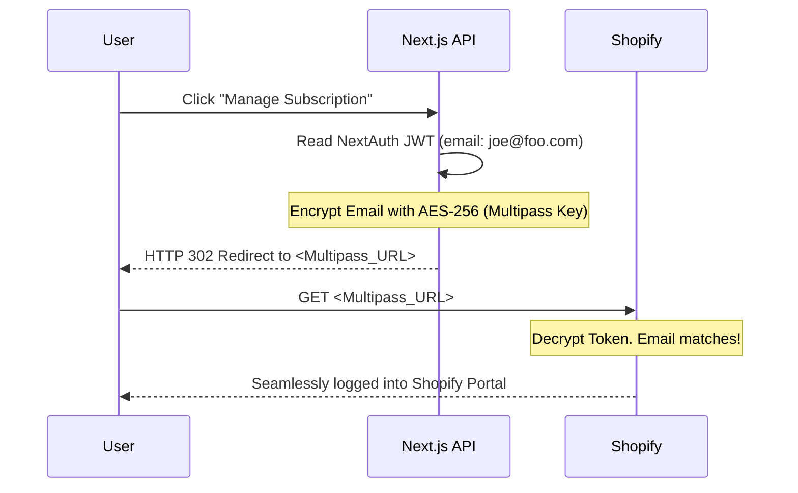

# Secure Identity & Account Engineering

**Estimated Time:** 60 Minutes

In Phase 2, you learned the theory of the Passwordless Identity Bridge. You learned that storing raw passwords in your own database is a liability, and that Shopify requires a Multipass token to merge user sessions.

Now, in Phase 3, we write the code. If you implement authentication incorrectly, a malicious actor can forge a session token, log in as another user, and extract their saved addresses and order history. This is a catastrophic GDPR/CCPA violation.

In this module, we will engineer a mathematically secure **OAuth2 / Magic Link** system using **NextAuth.js (Auth.js)**, and build the cryptographic **Shopify Multipass Bridge**.

---

## 1. NextAuth.js (The Secure Identity Provider)

You must never write your own JWT (JSON Web Token) encoding logic. The cryptographic nuances are too complex.

**The Production Solution:**
You will use **NextAuth.js**. It handles cookie encryption, CSRF (Cross-Site Request Forgery) protection, and session rotation natively. 

We will disable passwords completely and use a Magic Link (Email) provider.

```typescript
// app/api/auth/[...nextauth]/route.ts
import NextAuth from "next-auth";
import EmailProvider from "next-auth/providers/email";
import { PrismaAdapter } from "@auth/prisma-adapter";
import { prisma } from "@/lib/prisma";

export const authOptions = {
  adapter: PrismaAdapter(prisma), // Stores active sessions in PostgreSQL
  providers: [
    EmailProvider({
      server: process.env.EMAIL_SERVER, // e.g., Resend SMTP
      from: process.env.EMAIL_FROM,
      // The user clicks the link in their email, and NextAuth automatically logs them in
    }),
  ],
  session: {
    strategy: "jwt", // Use stateless JWTs for extreme Vercel edge performance
    maxAge: 30 * 24 * 60 * 60, // 30 Days
  },
  callbacks: {
    // Inject our custom Prisma User ID into the secure JWT token
    async jwt({ token, user }) {
      if (user) {
        token.id = user.id; 
      }
      return token;
    },
    async session({ session, token }) {
      if (session.user) {
        session.user.id = token.id as string;
      }
      return session;
    }
  }
};

const handler = NextAuth(authOptions);
export { handler as GET, handler as POST };
```

This code is impenetrable. When a user logs in, NextAuth sets a highly secure, `HttpOnly`, `SameSite=Lax` cookie in their browser. JavaScript cannot read this cookie, making your site immune to XSS (Cross-Site Scripting) token theft.

## 2. The Next.js Edge Middleware (Route Protection)

A beginner protects their `/account` page by putting a `useSession()` check in the React component. The server sends the HTML of the account page to the browser, and then the browser realizes the user isn't logged in and redirects them. This causes a "flash" of private content.

**The Production Solution:**
You must protect routes at the **Vercel Edge** before the Next.js server even begins rendering the page.

```typescript
// middleware.ts
import { withAuth } from "next-auth/middleware";
import { NextResponse } from "next/server";

export default withAuth(
  function middleware(req) {
    // If the token exists, NextAuth allows the request to pass.
    return NextResponse.next();
  },
  {
    callbacks: {
      // If this returns false, the user is instantly redirected to the /login page
      authorized: ({ token }) => !!token,
    },
  }
);

// ONLY run this middleware on the /account routes
export const config = { matcher: ["/account/:path*"] };
```

## 3. The Shopify Multipass Bridge

Your user is logged into your Next.js frontend via NextAuth. But when they click "Manage Subscription", you need to redirect them to the Shopify hosted checkout/portal. 
Shopify doesn't know who this user is because they didn't log into Shopify; they logged into Next.js.

**The Production Solution:**
You must implement **Shopify Multipass**. You cryptographically encode the user's email address using AES encryption and your secret Shopify Multipass Key.



When the user is redirected to Shopify with this encrypted token, Shopify decrypts it, trusts it, and instantly logs the user in without asking for a password.

---

## ✅ Account Engineering Checklist

- [ ] Ban raw passwords. Implement NextAuth.js with a Magic Link (Email) provider.
- [ ] Enforce route protection using Next.js Edge Middleware (`middleware.ts`) to prevent XSS flashes of private content.
- [ ] Implement the Shopify Multipass cryptographic bridge to achieve Single Sign-On (SSO) between Next.js and Shopify.
- [ ] Use the AI prompt below to generate the rigorous authentication code.

---

## AI Prompt — Engineer the Identity System

Copy this prompt into your AI to have it generate the mathematical identity layer.

````prompt
I am building a headless e-commerce store with Next.js (App Router). I need you to act as my Principal Security Engineer. We are engineering our Identity and Authentication layer using NextAuth.js (Auth.js).

I need you to generate the following strict, cryptographically secure implementations:

**1. The NextAuth Configuration:**
Write the complete `app/api/auth/[...nextauth]/route.ts` file. 
- You MUST use the `PrismaAdapter`.
- Configure the `EmailProvider` for Magic Links.
- Show the exact `jwt` and `session` callbacks required to securely inject the Prisma `user.id` into the JSON Web Token, ensuring we can access the ID in our Server Components.

**2. The Edge Middleware:**
Write the `middleware.ts` file. Show how to use `withAuth` to protect the `/account/*` routes. Explain why validating the token at the edge is vastly superior to checking session state inside a React Client Component.

**3. The Shopify Multipass Generator:**
Write a Node.js utility function (`lib/multipass.ts`) using the standard `crypto` library.
- It must accept an email address and an optional return URL.
- Show the exact AES-128-CBC encryption and HMAC-SHA256 signature logic required to construct a valid Shopify Multipass token.
- Write the Next.js Server Action that reads the active NextAuth session, generates this Multipass token, and returns the final Shopify redirect URL to the frontend.
````

**Next: Shipping Engineering →**
