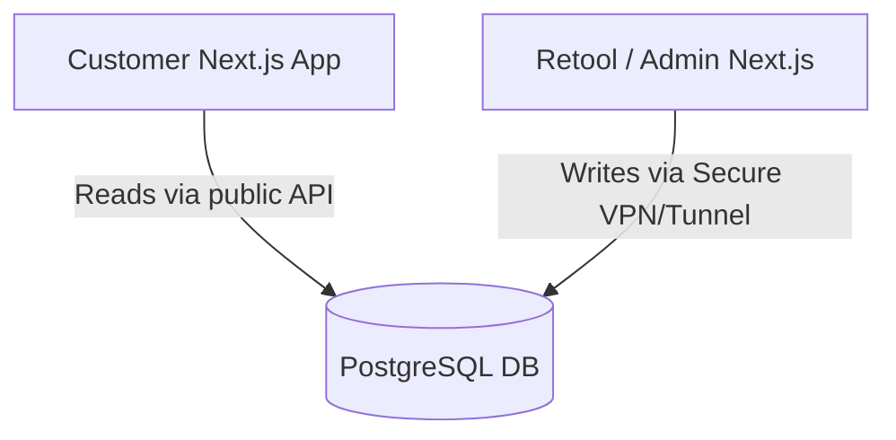

# Admin Dashboard & RBAC Engineering

**Estimated Time:** 60 Minutes

A beginner builds their Admin Dashboard inside the exact same Next.js repository as their customer-facing storefront. They add an `isAdmin: true` flag to their database and wrap a few pages in a basic `if (isAdmin)` check.

If a hacker finds an XSS vulnerability in the storefront, they can hijack an admin's cookie and gain full write-access to your database, changing prices or refunding orders. Furthermore, placing massive data-visualization charts inside your storefront repository slows down your build times and bloats your deployment.

In Phase 3, you must engineer **Total Separation of Concerns** by building a decoupled Admin Portal (often using low-code tools like Retool) and enforcing strict **Role-Based Access Control (RBAC)** at the API level.

---

## 1. The Decoupled Portal Strategy

You should not waste time building a custom React table for your orders. Shopify handles the core operations, but for custom data (Reviews, Wishlist analytics, custom User profiles), you need a dashboard.

**The Production Solution:**
You must use a tool like **Retool** or deploy a completely separate Next.js application strictly for internal tools (`admin.yourdomain.com`). 



By decoupling the Admin UI, you guarantee that a vulnerability in the storefront's React code cannot physically access the Admin interfaces. 

## 2. API-Level RBAC (Role-Based Access Control)

If you do build custom Admin API routes in your Next.js backend (e.g., `/api/admin/refund`), you cannot just check if the user is an "Admin". What if the user is a Junior Customer Support Rep? Should they be allowed to refund a $5,000 order?

**The Production Solution:**
You must implement mathematical Role-Based Access Control using an Enum.

```typescript
// types/rbac.ts
export enum Role {
  CUSTOMER = 'CUSTOMER',
  SUPPORT_TIER_1 = 'SUPPORT_TIER_1', // Can view orders, cannot refund
  SUPPORT_TIER_2 = 'SUPPORT_TIER_2', // Can refund up to $500
  SUPER_ADMIN = 'SUPER_ADMIN'        // Can do anything
}
```

In your Next.js API route, the validation must happen before the database is ever touched:

```typescript
// app/api/admin/refund/route.ts
import { getServerSession } from "next-auth";
import { authOptions } from "@/app/api/auth/[...nextauth]/route";

export async function POST(req: Request) {
  const session = await getServerSession(authOptions);

  // 1. Strict RBAC Gate
  if (!session || (session.user.role !== 'SUPER_ADMIN' && session.user.role !== 'SUPPORT_TIER_2')) {
    return NextResponse.json({ error: "Unauthorized" }, { status: 403 });
  }

  const { orderId, amount } = await req.json();

  // 2. Specific Rule Validation
  if (session.user.role === 'SUPPORT_TIER_2' && amount > 500) {
    // Write to the Audit Log: "Junior rep attempted illegal high-value refund"
    return NextResponse.json({ error: "Amount exceeds tier limits" }, { status: 403 });
  }

  // 3. Execute Refund...
}
```

This logic guarantees that even if a junior rep figures out how to send an HTTP POST request via Postman, the server will block it.

## 3. The Audit Log Architecture

As covered in the Orders module, you must log every mutation made by an admin.

If an admin updates a product description or deletes a malicious user review, you must record it. If a disgruntled employee tries to sabotage the database before quitting, the Audit Log is your only method of restoring the data.

**The Production Solution:**
Ensure every custom mutation API route writes a row to an `AdminAuditLog` table containing:
- `adminId`
- `action` (e.g., `DELETE_REVIEW`)
- `targetId` (e.g., the review UUID)
- `previousPayload` (a JSON snapshot of the data *before* they deleted it).

---

## ✅ Admin Engineering Checklist

- [ ] Decouple the Admin Dashboard from the main storefront repository. Use tools like Retool to save hundreds of engineering hours.
- [ ] Enforce strict Role-Based Access Control (RBAC) at the Next.js API level.
- [ ] Maintain an immutable Audit Log of all admin actions, including JSON snapshots of deleted data for safe recovery.
- [ ] Use the AI prompt below to generate the RBAC middleware logic.

---

## AI Prompt — Engineer the RBAC System

Copy this prompt into your AI to have it generate the mathematical security gates for your admin tools.

````prompt
I am building a headless e-commerce store with Next.js (App Router). I need you to act as my Principal Security Engineer. We are engineering our Role-Based Access Control (RBAC) system for custom internal API routes.

I need you to generate the following strict security implementations:

**1. The RBAC Enum & Types:**
Define a TypeScript Enum for `UserRole` containing `CUSTOMER`, `SUPPORT`, and `ADMIN`. Show how to update our Prisma `schema.prisma` `User` model to include this role, defaulting to `CUSTOMER`.

**2. The NextAuth Session Injector:**
Show the exact NextAuth callback code required to pull the user's `role` from Prisma and securely embed it into the JWT, so that `session.user.role` is accessible in our API routes.

**3. The Secure API Gate:**
Write a Next.js Server Action (`deleteProductReview.ts`). 
- It must read the session to verify the user is an `ADMIN`. 
- If unauthorized, throw a strict error.
- If authorized, show a Prisma transaction that deletes the review AND simultaneously creates a row in an `AdminAuditLog` table. The audit log must record the `adminId`, the `reviewId`, and a JSON snapshot of the review text that was deleted in case we need to restore it.
````

**Phase 3 is complete. Prepare for Phase 4 (Production Readiness).**
