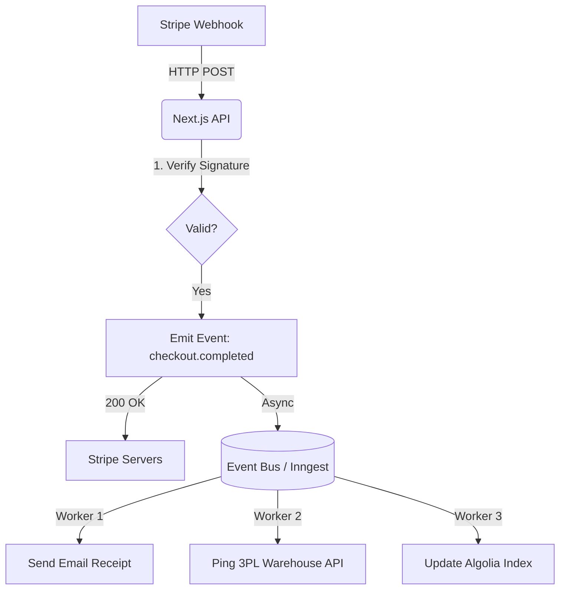

# Backend APIs & Event-Driven Architecture

**Estimated Time:** 60 Minutes

A beginner builds a backend by writing a giant Next.js API route that executes 15 different tasks synchronously: 
1. Capture Stripe Payment -> 2. Insert Order into Database -> 3. Email the Customer -> 4. Ping the Warehouse -> 5. Update Algolia.

If step 4 (the Warehouse API) times out, the entire function crashes. The user sees a `500 Error` on the checkout page, but their credit card was already charged in step 1. The database was never updated, and the customer never got an email. This is catastrophic.

In Phase 3, you must engineer an **Event-Driven Architecture (EDA)**. The Next.js API routes must execute one task perfectly, and delegate everything else to asynchronous background workers.

---

## 1. The Next.js Route Handler Topology

Next.js App Router uses Route Handlers (`app/api/route.ts`). In a production environment, you must strictly define the caching and edge capabilities of these routes.

- **Edge Runtime (`export const runtime = 'edge'`):** Used for lightweight tasks (like Geo-IP redirection or proxying a simple fetch request). Executes globally in 10ms. Does *not* support Node.js APIs (like the standard `pg` database driver).
- **Node.js Runtime (Default):** Used for heavy tasks (Prisma database connections, cryptographic webhook verification). Executes in a specific region (e.g., `iad1` Washington D.C.).

**The Security Mandate:** 
Every Next.js API route that mutates data must enforce strict validation. If you do not validate the incoming JSON payload, hackers will inject malicious SQL or corrupt your database. You must use **Zod** to mathematically guarantee the shape of the incoming request.

```typescript
// app/api/reviews/route.ts
import { z } from 'zod';
import { NextResponse } from 'next/server';
import { prisma } from '@/lib/prisma';

// 1. Define the mathematical shape of the incoming data
const ReviewSchema = z.object({
  productId: z.string().min(1),
  rating: z.number().min(1).max(5), // Mathematically prevents a 6-star rating
  content: z.string().min(10).max(1000), // Enforce length limits to prevent DB bloat
});

export async function POST(req: Request) {
  try {
    const json = await req.json();
    
    // 2. Mathematically validate the payload
    const data = ReviewSchema.parse(json);
    
    // 3. Execute the database mutation safely
    const review = await prisma.review.create({
      data: {
        productId: data.productId,
        rating: data.rating,
        content: data.content,
        userId: "session-id-here", // Extracted securely from NextAuth token
      }
    });

    return NextResponse.json(review, { status: 201 });
  } catch (error) {
    // 4. Handle Zod validation errors gracefully
    if (error instanceof z.ZodError) {
      return NextResponse.json({ error: error.errors }, { status: 400 });
    }
    return NextResponse.json({ error: "Internal Server Error" }, { status: 500 });
  }
}
```

---

## 2. Event-Driven Decoupling (Inngest / QStash)

To solve the catastrophic failure scenario mentioned in the introduction, you must implement an **Event Bus**. 

When the checkout completes, your Next.js API route does exactly two things:
1. Verifies the Stripe payment.
2. Emits an event: `checkout.completed`.

It immediately returns a `200 Success` to the browser. The frontend is incredibly fast.



By decoupling these tasks, if the 3PL Warehouse API goes down (Worker 2 fails), the Event Bus simply catches the error and automatically retries Worker 2 every 5 minutes until it succeeds. The email was still sent, and the checkout never crashed.

---

## 3. Webhook Cryptographic Verification

Your Next.js API routes will listen for webhooks from third parties (Shopify, Stripe). These are public URLs (`https://yourdomain.com/api/webhooks/stripe`). Anyone can send a POST request to them.

You MUST implement **HMAC-SHA256 Verification** on every webhook endpoint.

```typescript
// Example Logic Flow (Not complete code)
const sigHeader = request.headers.get('stripe-signature');
const rawBody = await request.text(); // MUST be raw text, not parsed JSON

try {
  // The Stripe SDK mathematically hashes the rawBody using your secret key.
  // If the hash matches the sigHeader, you know the request is authentically from Stripe.
  const event = stripe.webhooks.constructEvent(rawBody, sigHeader, process.env.STRIPE_WEBHOOK_SECRET);
} catch (err) {
  // If a hacker sent a fake payload, the hashes won't match, and the code throws here.
  return new Response("Unauthorized", { status: 401 });
}
```

---

## ✅ Backend Engineering Checklist

- [ ] Mandate Zod for strict validation of all incoming API JSON payloads to prevent injection attacks.
- [ ] Decouple complex workflows (like checkout fulfillment) using an Event Bus (Inngest or Upstash QStash).
- [ ] Enforce HMAC-SHA256 signature verification on all public webhook endpoints.
- [ ] Use the AI prompt below to generate your event-driven workers.

---

## AI Prompt — Engineer the Event-Driven Backend

Copy this prompt into your AI to have it engineer the fault-tolerant, event-driven API layer.

````prompt
I am building a headless e-commerce store with Next.js (App Router). I need you to act as my Principal Backend Engineer. We are establishing our Event-Driven API Architecture.

We must decouple long-running tasks from our user-facing API routes to guarantee 200ms response times and prevent catastrophic failure chains.

I need you to generate the following engineering implementations:

**1. The Strict Zod Route Handler:**
Write a Next.js `app/api/newsletter/route.ts` handler for email signups. 
- You MUST define a Zod schema to validate the email string.
- Show the `try/catch` block handling Zod validation errors (returning a 400 status).
- Instead of synchronously calling the Mailchimp/Resend API, show how the route safely drops a `newsletter.signup` event into our Event Bus (e.g., Inngest or QStash) and instantly returns a 201 Success.

**2. The Asynchronous Worker:**
Write the background worker function (e.g., an Inngest function) that listens for the `newsletter.signup` event. 
- Show how it receives the payload.
- Show the `fetch` request to the 3rd party email API.
- Explain how the Event Bus automatically handles exponential backoff and retries if the email API returns a `500 Server Error`, ensuring no data is ever lost.

**3. Webhook Signature Protection:**
Provide a code snippet for a Next.js App Router webhook endpoint demonstrating exactly how to read the raw body (`req.text()`) to perform HMAC cryptographic verification (using crypto or a provider SDK like Stripe/Shopify) before processing the payload.
````

**Next: Frontend Engineering →**
