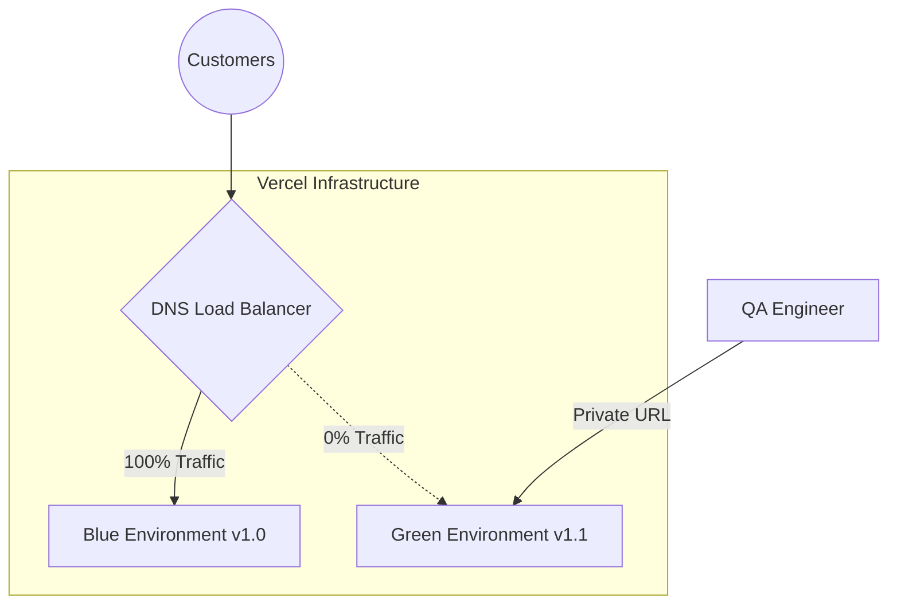

# Advanced Deployment Architectures (Blue/Green)

> [!TIP]
> **For Beginners:** If you are reading this and feeling overwhelmed by terms like "Redis", "PgBouncer", or "Idempotency", do not panic. 
> At the bottom of this document, there is an **AI Prompt**. You do not need to write this complex code yourself. You simply need to understand *why* this architecture is required, copy the AI Prompt, and paste it into Claude or ChatGPT to have it generate the production-ready code for you.


**Estimated Time:** 60 Minutes

A beginner launches an update to their store by typing `git push origin main` and waiting for Vercel to overwrite the live website. 

What happens if the new code contains a critical bug that disables the checkout button? The live website is instantly broken. You scramble to find the bug, type `git revert`, and wait 5 minutes for Vercel to rebuild the old code. During those 5 minutes, 100 customers tried to buy something and failed. You just lost thousands of dollars.

In a production environment, you never overwrite the live website blindly. You must engineer **Blue/Green Deployments**, **Canary Releases**, and **Automated Rollbacks**.

---

## 1. Blue/Green Deployments

Blue/Green deployment is a technique where you maintain two identical production environments: "Blue" (the currently live version) and "Green" (the new version).

**The Production Solution:**
When you merge code into `main`, Vercel (or AWS) automatically builds the "Green" environment. It does *not* send any customer traffic to it yet. 

Your automated testing suite (Playwright) runs against the Green environment. Your QA team manually logs into the Green environment via a secret URL (`green.yourstore.com`) and tests the checkout.

Once the Green environment is verified to be 100% mathematically perfect, you press a button to swap the DNS router. 



When you swap the router, 100% of traffic instantly shifts to Green. If a bug is discovered 10 seconds later, you click "Swap" again, and traffic instantly reverts back to Blue. **Zero downtime. Zero risk.**

## 2. Canary Releases (Gradual Rollouts)

What if you redesigned the entire checkout flow, and you aren't sure if customers will like it? Even if it works perfectly in QA, it might lower your conversion rate.

**The Production Solution:**
You must engineer a **Canary Release**. Instead of shifting 100% of traffic to the new Green environment, you configure your Vercel Edge Router (or LaunchDarkly feature flags) to shift exactly **5% of traffic**.

```typescript
// middleware.ts (Vercel Edge)
import { NextResponse } from 'next/server';

export function middleware(req) {
  // 1. Generate a random number between 1 and 100
  const random = Math.floor(Math.random() * 100) + 1;

  // 2. If the user doesn't already have a variant cookie...
  let variant = req.cookies.get('checkout_variant')?.value;
  
  if (!variant) {
    // 5% of users get the 'canary' checkout
    variant = random <= 5 ? 'canary' : 'control';
  }

  // 3. Rewrite the URL to the hidden Canary route
  const res = variant === 'canary' 
    ? NextResponse.rewrite(new URL('/checkout-v2', req.url))
    : NextResponse.next();

  // 4. Set the cookie so the user doesn't bounce between versions
  res.cookies.set('checkout_variant', variant);
  
  return res;
}
```

You monitor the conversion rate of that 5% for 24 hours. If the conversion rate increases, you dial the router up to 25%, then 50%, then 100%. If the conversion rate tanks, you dial it back to 0%.

## 3. Database Migrations (The Breaking Change)

If your Green environment requires a new database column (e.g., `user.phoneNumber`), and you run Prisma `db push` to add it, you might accidentally break the Blue environment if it wasn't expecting that column.

**The Production Solution:**
Database migrations in a Blue/Green environment must be **Backward Compatible**.

**Phase 1:** You run the Prisma migration to add the column, but you do NOT require it (`phoneNumber String?`). Both Blue and Green environments run perfectly.
**Phase 2:** You swap traffic to Green. Green starts writing to the `phoneNumber` column. Blue is offline.
**Phase 3:** Weeks later, when Blue is permanently destroyed, you run a second migration to make the column mandatory (`phoneNumber String`).

You must never rename or drop a column in a single deployment.

---

## ✅ CI/CD Engineering Checklist

- [ ] Disable automatic production promotion in Vercel. Utilize Preview Deployments (Green) as staging grounds.
- [ ] Implement Vercel Edge Middleware or LaunchDarkly to execute Canary Releases for high-risk UI updates.
- [ ] Enforce backward-compatible database migrations (Expand and Contract pattern) to prevent Prisma crashes during Blue/Green swaps.
- [ ] Use the AI prompt below to generate the rigorous deployment architecture.

---

## AI Prompt — Engineer the CI/CD Pipeline

Copy this prompt into your AI to have it generate the mathematical deployment strategies.

````prompt
I am building a headless e-commerce store with Next.js (App Router). I need you to act as my Principal Release Engineer. We are engineering our Blue/Green Deployment and Canary Release architecture.

I need you to generate the following strict DevOps implementations:

**1. The Canary Edge Middleware:**
Write the exact `middleware.ts` code required to route 10% of new traffic to a rewritten `/checkout-v2` path. 
- You MUST show the logic for reading and setting a `visitor_group` cookie so that a user who receives the Canary version continues to receive it on subsequent page loads (sticky sessions).

**2. The Backward-Compatible Prisma Migration:**
Provide a Markdown tutorial explaining the "Expand and Contract" database migration pattern. 
- Show a `schema.prisma` file where we want to rename `userId` to `accountId`. 
- Explain why doing this in one step will instantly crash the Blue environment. 
- Provide the exact two-phase step-by-step process required to rename a column with zero downtime.

**3. Automated Playwright Rollbacks:**
Write a mock GitHub Action script showing how to trigger a Vercel Rollback API call if a post-deployment Checkly ping fails, mathematically ensuring the site heals itself if a broken Green deployment slips through.
````

**Next: Payment Security →**
