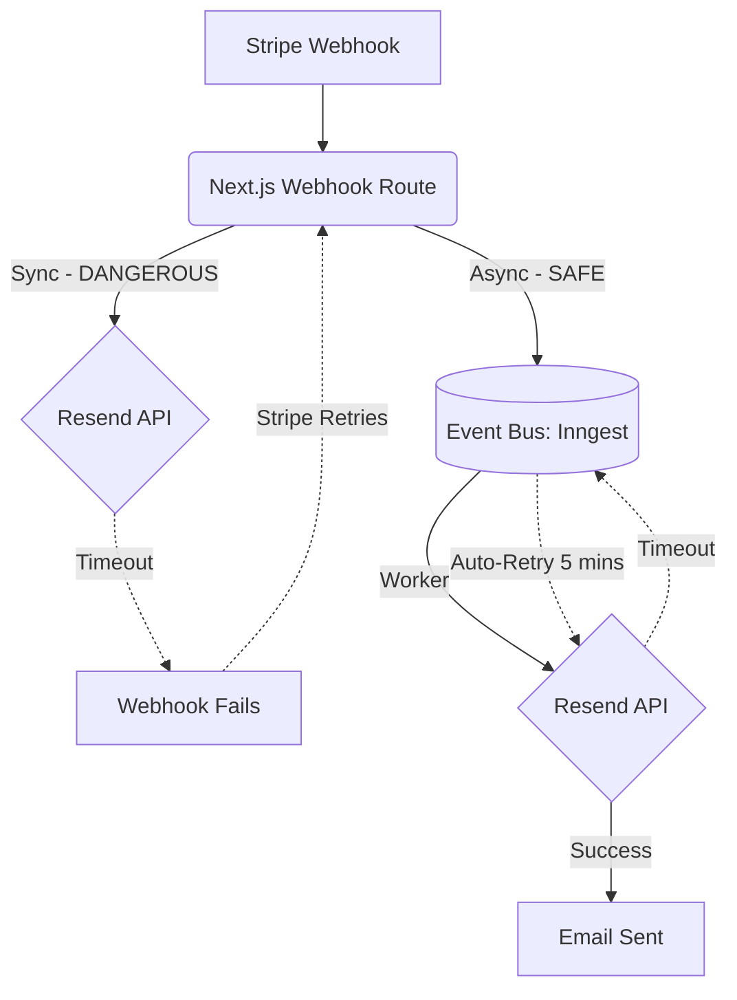

# Transactional Email Engineering

> [!TIP]
> **For Beginners:** If you are reading this and feeling overwhelmed by terms like "Redis", "PgBouncer", or "Idempotency", do not panic. 
> At the bottom of this document, there is an **AI Prompt**. You do not need to write this complex code yourself. You simply need to understand *why* this architecture is required, copy the AI Prompt, and paste it into Claude or ChatGPT to have it generate the production-ready code for you.


**Estimated Time:** 60 Minutes

A beginner views emails as simple text messages. They use the basic Node.js `nodemailer` package to send an HTML string like `<h1>Thanks for buying!</h1>` directly from their checkout API route.

In a production environment, if you send ugly, unbranded HTML emails, customers assume you are a scam. If you send emails synchronously during the checkout request, and the SMTP server times out, your checkout crashes. If you don't configure DKIM and SPF records, your emails go straight to the Spam folder, and angry customers issue chargebacks because they think they never received their receipt.

In Phase 3, you must engineer a **Decoupled, Component-Driven Email Pipeline** utilizing React Email and a modern transactional provider (like Resend or Postmark).

---

## 1. React Email (Component-Driven Templates)

Writing raw HTML tables for emails is notoriously difficult because email clients (Outlook, Gmail, Apple Mail) render HTML differently. 

**The Production Solution:**
You must use **React Email**. This allows you to write emails using standard React components and Tailwind CSS. The engine then compiles your React code down into perfectly compliant, bulletproof HTML tables that look flawless in every email client.

```tsx
// emails/ReceiptEmail.tsx
import { Html, Body, Head, Heading, Container, Text, Tailwind } from '@react-email/components';

interface ReceiptProps {
  customerName: string;
  orderTotal: number;
  orderId: string;
}

export default function ReceiptEmail({ customerName, orderTotal, orderId }: ReceiptProps) {
  return (
    <Html>
      <Head />
      <Tailwind>
        <Body className="bg-white my-auto mx-auto font-sans">
          <Container className="border border-solid border-[#eaeaea] rounded my-[40px] mx-auto p-[20px] w-[465px]">
            <Heading className="text-black text-[24px] font-normal text-center p-0 my-[30px] mx-0">
              Your Order is Confirmed
            </Heading>
            <Text className="text-black text-[14px] leading-[24px]">
              Hello {customerName},
            </Text>
            <Text className="text-black text-[14px] leading-[24px]">
              We received your order #{orderId}. We will notify you when it ships. 
              The total was ${orderTotal.toFixed(2)}.
            </Text>
          </Container>
        </Body>
      </Tailwind>
    </Html>
  );
}
```

By keeping your emails inside your Next.js repository as React components, your design system (colors, fonts, logos) remains perfectly synchronized across your website and your emails.

---

## 2. Decoupled Delivery via Event Bus

Never, ever `await` an email delivery inside your checkout or webhook API route.



If the Resend API goes down for 5 minutes, and your webhook route `awaits` the email, your webhook fails. Stripe will retry the webhook. If you wrote bad database logic, you might process the order twice.

**The Production Solution:**
When the Stripe webhook arrives, mark the order as `PAID` in PostgreSQL, and drop an event (`order.paid`) into Inngest (or Kafka). The webhook instantly returns `200 OK`. 

A background worker picks up the `order.paid` event and sends the React Email. If Resend is down, Inngest automatically pauses and retries the email an hour later. No data is lost, and the webhook never times out.

---

## 3. Deliverability Infrastructure (DKIM/SPF)

You can write the most beautiful React email in the world, but if it lands in Spam, your business fails.

**The Production Solution:**
You must instruct your AI to provide the exact DNS records required to authenticate your sending domain.
- **SPF (Sender Policy Framework):** Tells Gmail that Resend is legally authorized to send emails on behalf of `yourdomain.com`.
- **DKIM (DomainKeys Identified Mail):** Cryptographically signs the email header to prove the email was not tampered with in transit.
- **DMARC:** Tells Gmail what to do if an email fails SPF/DKIM (e.g., "Reject it").

You must configure these in your DNS provider (Vercel/Cloudflare) before sending a single production email.

---

##  Email Engineering Checklist

- [ ] Ban raw HTML email templates. Mandate React Email for perfect cross-client rendering.
- [ ] Never `await` email sends in critical paths. Delegate all emails to an asynchronous Event Bus worker.
- [ ] Configure SPF, DKIM, and DMARC in your DNS to guarantee inbox placement.
- [ ] Use the AI prompt below to generate the React Email pipeline.

---

## AI Prompt — Engineer Transactional Emails

Copy this prompt into your AI to have it generate the decoupled React Email infrastructure.

````prompt
I am building a headless e-commerce store with Next.js (App Router). I need you to act as my Principal Communications Engineer. We are engineering our Transactional Email Pipeline using React Email and Resend.

We must decouple email delivery from our main API routes to prevent timeouts.

I need you to generate the following engineering implementations:

**1. The React Email Component (`ReceiptEmail.tsx`):**
Write a transactional receipt email using `@react-email/components` and Tailwind CSS. 
- It must receive props for `orderId`, `customerName`, and `lineItems` (an array of products with prices).
- Show how to map over the `lineItems` to render a clean, HTML-table-compliant invoice grid.

**2. The Asynchronous Email Worker:**
Write the background worker function (e.g., using Inngest or Upstash QStash) that listens for the `order.paid` event. 
- Show how it retrieves the order details from our database (e.g., Prisma).
- Show the exact `resend.emails.send` API call, passing the compiled React Email component into the `react` parameter.
- Explain how this background worker prevents our main Stripe webhook route from timing out.

**3. DNS Deliverability Instructions:**
Provide a strict markdown list of the standard DNS TXT and CNAME records I need to configure in Cloudflare/Vercel to establish SPF, DKIM, and DMARC for a generic domain to ensure these transactional emails bypass the Gmail spam folder.
````

**Next: Notifications & Event Routing →**
