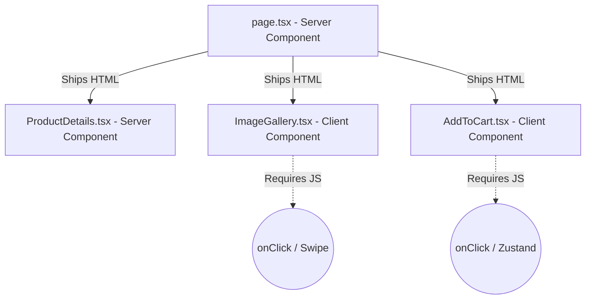

# High-Performance Frontend Engineering

> [!TIP]
> **For Beginners:** If you are reading this and feeling overwhelmed by terms like "Redis", "PgBouncer", or "Idempotency", do not panic. 
> At the bottom of this document, there is an **AI Prompt**. You do not need to write this complex code yourself. You simply need to understand *why* this architecture is required, copy the AI Prompt, and paste it into Claude or ChatGPT to have it generate the production-ready code for you.


**Estimated Time:** 60 Minutes

Welcome to the visual layer. A beginner writes frontend React code by throwing a bunch of `useEffect` hooks into a massive file and hoping the data loads before the user clicks away. 

In a mass-production e-commerce environment, frontend performance directly dictates revenue. Amazon discovered that every 100ms of latency cost them 1% of total sales. If your Next.js application forces the browser to download 2MB of bloated JavaScript and executes endless re-renders, your Core Web Vitals will tank, Google will penalize your SEO, and your mobile bounce rate will skyrocket.

In Phase 3, you must engineer a highly optimized, component-driven architecture leveraging **React Server Components (RSC)** and strict **Client-Side Hydration Boundaries**.

---

## 1. The React Server Component (RSC) Paradigm

In the Next.js App Router, components are Server Components by default. This is the biggest architectural shift in modern React.

A Server Component executes entirely on the Vercel edge node. It can securely connect to databases and access private API keys. **Crucially, the JavaScript for a Server Component is NEVER sent to the browser.** It ships pure, instant HTML.

**The Production Rule:**
You must push logic as high up the tree as possible into Server Components. You only declare a Client Component (`"use client"`) when you absolutely need browser interactivity (`onClick`, `useState`, or browser APIs like `localStorage`).



By pushing the heavy Markdown parsing and API fetching into the Server Components (`page.tsx` and `ProductDetails.tsx`), you strip 100kb+ of JavaScript out of the mobile bundle, ensuring lightning-fast Time to Interactive (TTI).

---

## 2. Granular Data Fetching (SWR / TanStack Query)

When you do need to fetch volatile data on the client (like the real-time inventory count inside the `<AddToCart />` component), beginners use `useEffect` and `fetch()`.

This causes the "Waterfall" problem: The component mounts, waits 500ms for data, the state updates, the component re-renders, and the UI flashes wildly. Furthermore, it lacks native caching, meaning if the user navigates away and clicks back, the component executes the 500ms fetch all over again.

**The Production Solution:**
You must mandate the use of **SWR (stale-while-revalidate)** or **TanStack Query**.

```typescript
'use client';
import useSWR from 'swr';
import { fetcher } from '@/lib/fetcher';

export function AddToCart({ productId }: { productId: string }) {
  // SWR handles caching, deduplication, and loading states natively.
  const { data, error, isLoading } = useSWR(`/api/inventory/${productId}`, fetcher);

  if (isLoading) return <SkeletonButton />;
  if (error || data.inventory === 0) return <SoldOutButton />;

  return <Button>Add to Cart - Only {data.inventory} left!</Button>;
}
```

If five different components on the screen use `useSWR('/api/inventory/123')`, SWR mathematically deduplicates them into a **single network request**, preventing rate-limits and saving massive amounts of Egress bandwidth.

---

## 3. Layout Shift (CLS) Prevention

Cumulative Layout Shift (CLS) is when the text on a webpage jumps down because a large image suddenly loaded above it. Google heavily penalizes sites with bad CLS.

In e-commerce, product images are the primary cause of CLS.

**The Production Solution:**
You must explicitly define the **Aspect Ratio** of every image container before the image even begins downloading. 

```tsx
// ❌ BAD: The browser doesn't know the height until the image downloads. The page will jump.


// ✅ GOOD: The container reserves a perfect square in the DOM instantly. Zero layout shift.
<div className="relative w-full aspect-square bg-gray-100">
  <Image 
    src="/shirt.jpg" 
    alt="Shirt"
    fill 
    className="object-cover"
    sizes="(max-width: 768px) 100vw, 50vw"
  />
</div>
```

---

## ✅ Frontend Engineering Checklist

- [ ] Maximally leverage React Server Components (RSC) to strip JavaScript from the browser bundle.
- [ ] Push `"use client"` boundaries as far down the component tree as possible (e.g., wrap only the button, not the whole section).
- [ ] Forbid raw `useEffect` fetches. Mandate SWR or TanStack Query for caching and deduplication.
- [ ] Eliminate CLS by enforcing `aspect-ratio` utility classes on all image containers.

---

## AI Prompt — Engineer the Performant Frontend

Copy this prompt into your AI to have it generate the highly optimized React architecture required for a flawless Core Web Vitals score.

````prompt
I am building a headless e-commerce store with Next.js (App Router). I need you to act as my Principal Frontend Engineer. We must engineer a deeply optimized Product Detail Page (PDP) leveraging React Server Components (RSC) and strict Hydration Boundaries.

I need you to generate the following engineering implementations:

**1. The RSC Page Shell:**
Write the `app/product/[slug]/page.tsx` file. 
- It MUST be a pure Server Component. 
- Show how it fetches the static product data (Title, Description) directly from the CMS/Commerce API securely without exposing keys to the client.
- Show how it passes specific props down to the nested Client Components.

**2. The Granular Hydration Boundary:**
Write the `<ProductActionArea />` component. 
- It MUST use `"use client"`.
- It will receive the `productId` as a prop.
- Write the logic using `useSWR` to fetch the real-time pricing and inventory count.
- You MUST implement a visually identical `<Skeleton />` fallback while SWR is in the `isLoading` state to prevent Cumulative Layout Shift (CLS).

**3. The CLS-Proof Image Gallery:**
Write the `<Gallery />` component. Show the exact Tailwind classes (`relative`, `aspect-square`, `object-cover`) combined with the `next/image` component required to lock the layout in place mathematically before the image bytes arrive over the network.
````

**Next: Payments Engineering →**
