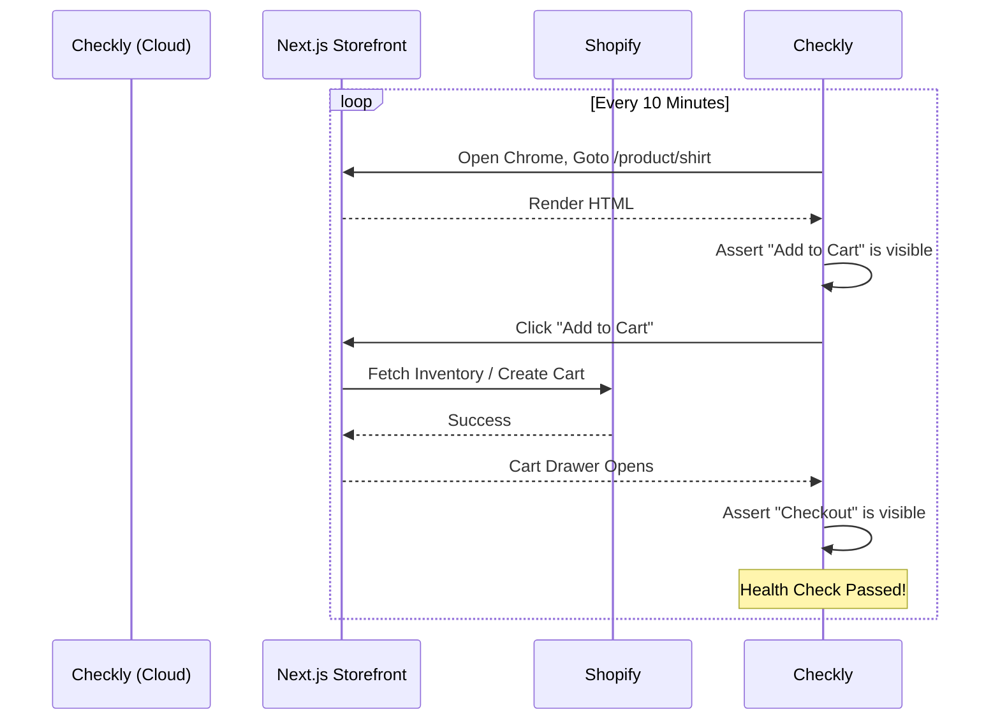

# Synthetic Monitoring & Uptime

**Estimated Time:** 60 Minutes

A beginner relies on their customers to tell them when the store is broken. If the Shopify API key expires on a Friday night, the checkout button breaks. The beginner wakes up on Monday morning, checks their dashboard, sees $0 in sales, and realizes they lost three days of revenue.

In a mass-production environment, you must know your checkout is broken *before* your customers do.

In Phase 4, you must engineer **Synthetic Monitoring (Ping Checks)** and **Active E2E Health Checks** using platforms like Datadog, Checkly, or Better Stack.

---

## 1. Synthetic Ping Monitoring

The most basic layer of defense is checking if your website is physically online.

If your Vercel deployment crashes, or your domain's DNS records expire, the website returns a `502 Bad Gateway` or `500 Internal Server Error`.

**The Production Solution:**
You must configure a Synthetic Ping Monitor (e.g., UptimeRobot, Better Stack, or Datadog). 

This service sends an HTTP `GET` request to your homepage (`https://yourstore.com`) every 30 seconds from a server in London, a server in Tokyo, and a server in New York. 
- If the response code is `200 OK`, it sleeps.
- If the response code is `500`, it immediately triggers a PagerDuty alert, calls your cell phone, and posts a `FATAL` message in your Slack channel.

## 2. Active E2E Health Checks (The "Buy Now" Test)

A Ping test only proves your Next.js server is turned on. It does *not* prove your store is actually working.

What if your frontend is perfectly online (`200 OK`), but the Shopify GraphQL API is down? The homepage loads, but every product says "$0.00" and the "Add to Cart" button throws a silent React error. Your Ping test will say you have 100% uptime, but you are making zero money.

**The Production Solution:**
You must implement an Active E2E Health Check using a tool like **Checkly**.

Checkly runs actual Playwright scripts (the same ones you wrote in the Testing module) in the cloud every 10 minutes.



If Shopify goes down, the "Add to Cart" button will fail. Checkly detects the failure within 10 minutes and triggers a catastrophic alert to your phone. You have successfully decoupled your monitoring from your customer's experience.

## 3. Custom Health API Routes

For internal services (like your Prisma Database or your Redis cache), you must expose a public `/api/health` route that your monitoring tools can ping to verify the internal organs of your application are functioning.

```typescript
// app/api/health/route.ts
import { NextResponse } from 'next/server';
import { prisma } from '@/lib/prisma';
import { redis } from '@/lib/redis';

export async function GET(req: Request) {
  try {
    // 1. Verify Database Connection
    await prisma.$queryRaw`SELECT 1`;
    
    // 2. Verify Redis Connection
    await redis.ping();

    // 3. Verify Shopify API Key is valid
    const shopifyReq = await fetch('https://your-store.myshopify.com/api/2023-10/graphql.json', {
       // ... headers
    });
    if (!shopifyReq.ok) throw new Error("Shopify unreachable");

    return NextResponse.json({ status: 'healthy' }, { status: 200 });

  } catch (error) {
    // If ANY of the internal organs fail, return a 503. 
    // Better Stack will see this 503 and trigger an SMS alert to your phone.
    return NextResponse.json(
      { status: 'unhealthy', reason: error.message }, 
      { status: 503 }
    );
  }
}
```

---

## ✅ Monitoring Engineering Checklist

- [ ] Configure a 60-second Synthetic Ping monitor (Better Stack/UptimeRobot) to verify global DNS and server uptime.
- [ ] Configure an Active E2E Playwright script (Checkly) to physically test the "Add to Cart" button in a real browser every 10 minutes.
- [ ] Build an `/api/health` Next.js route that mathematically verifies your Prisma, Redis, and Shopify connections.
- [ ] Use the AI prompt below to generate the monitoring architecture.

---

## AI Prompt — Engineer the Uptime Monitors

Copy this prompt into your AI to have it architect your synthetic monitoring system.

````prompt
I am building a headless e-commerce store with Next.js (App Router). I need you to act as my Principal Site Reliability Engineer (SRE). We are engineering our Synthetic Monitoring and Health Checks.

I need you to generate the following strict monitoring implementations:

**1. The Internal Organ Health Check:**
Write the Next.js API Route handler (`/api/health`). 
- It must execute a lightweight raw SQL query (`SELECT 1`) to verify the PostgreSQL connection pool (via Prisma) is alive.
- It must execute a lightweight `fetch` to the Shopify Storefront API.
- If everything passes, return a `200 OK`. If anything throws an error, catch it and return a `503 Service Unavailable`, logging the exact subsystem that failed. Explain how a tool like Datadog or Better Stack interacts with this specific endpoint.

**2. The Checkly E2E Script:**
Write the Playwright script intended for execution inside Checkly.
- It must navigate to the homepage.
- It must search for a product using the search bar.
- It must click the product to view the PDP (Product Detail Page).
- It must verify the price element exists and contains a `$` symbol.
- Explain why running this script every 10 minutes from AWS US-East guarantees we discover Shopify API outages before our customers do.
````

**Next: Logging Engineering →**
