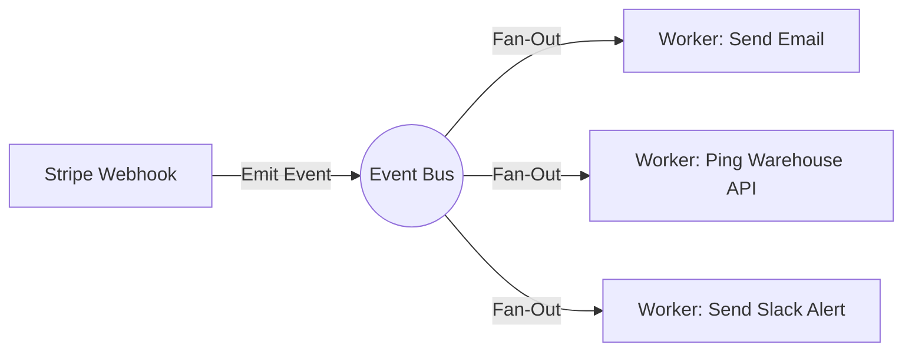

# Notification & Event Routing

> [!TIP]
> **For Beginners:** If you are reading this and feeling overwhelmed by terms like "Redis", "PgBouncer", or "Idempotency", do not panic. 
> At the bottom of this document, there is an **AI Prompt**. You do not need to write this complex code yourself. You simply need to understand *why* this architecture is required, copy the AI Prompt, and paste it into Claude or ChatGPT to have it generate the production-ready code for you.


**Estimated Time:** 45 Minutes

A beginner checks their e-commerce store by manually logging into the Shopify dashboard every three hours and hitting "Refresh" to see if they got an order. If a high-value customer's credit card fails, the beginner doesn't know until they manually check the logs two days later.

In a mass-production environment, the system must push critical events to the humans, not the other way around. 

In Phase 3, you must engineer a **Centralized Event Routing Hub**. When an order comes in, the system must instantly notify the warehouse, alert the customer support team in Slack, and push a high-priority SMS to the founder if a catastrophic error occurs.

---

## 1. The Slack Webhook Integration (Ops Visibility)

Your team (or just you) lives in Slack or Discord. Your store must communicate its health directly into your chat workspace.

**The Production Solution:**
You must configure an **Incoming Webhook** in Slack. This generates a secret URL. You will write a Next.js utility function that formats a JSON payload and POSTs it to this URL whenever a critical event occurs in your codebase.

```typescript
// lib/slack.ts
export async function sendSlackAlert(message: string, type: 'info' | 'error' | 'success') {
  const webhookUrl = process.env.SLACK_WEBHOOK_URL;
  if (!webhookUrl) return;

  const color = type === 'error' ? '#FF0000' : type === 'success' ? '#00FF00' : '#0000FF';

  await fetch(webhookUrl, {
    method: 'POST',
    body: JSON.stringify({
      attachments: [
        {
          color: color,
          blocks: [
            {
              type: 'section',
              text: { type: 'mrkdwn', text: `*Store Notification:*\n${message}` }
            }
          ]
        }
      ]
    })
  });
}
```

When a user places an order, the background worker instantly executes `sendSlackAlert('New Order #1002 - $150.00', 'success')`. Your phone buzzes instantly. You have achieved total operational visibility.

## 2. Event Routing (The Fan-Out Pattern)

When an `order.paid` event occurs, you don't just have one notification to send. 
1. The Customer needs a Receipt Email.
2. The Warehouse needs a JSON payload via an API.
3. The Ops Team needs a Slack message.

If you write a single function that does all three synchronously, and the Slack API is down, the entire function crashes and the Warehouse never gets the order.

**The Production Solution:**
You must implement the **Fan-Out Pattern** using your Event Bus (Inngest).



Inngest allows you to register multiple separate functions that all listen to the exact same `order.paid` event. They execute entirely independently of one another. If the Slack API crashes, the Slack Worker fails and retries, but the Email Worker and Warehouse Worker succeed perfectly.

## 3. High-Priority SMS Routing (Twilio)

Slack is great for general ops, but what if your Algolia search index goes down on Black Friday? You cannot rely on a Slack message that you might mute.

**The Production Solution:**
For `FATAL` severity events (e.g., Prisma database connection pool exhausted, or Stripe API throwing `500` errors for 5 consecutive checkouts), you must implement an SMS escalation path using **Twilio**.

You will instruct your AI to write an Error Boundary utility that traps unhandled exceptions in the checkout flow. If the error is flagged as `FATAL`, it bypasses Slack and immediately executes a Twilio API call to SMS the on-call engineer (or the solo founder).

---

## ✅ Notifications Engineering Checklist

- [ ] Set up a Slack Incoming Webhook to pump operational visibility directly into your chat workspace.
- [ ] Utilize the Fan-Out pattern in your Event Bus to execute multiple independent notifications from a single event.
- [ ] Implement a Twilio SMS escalation path strictly reserved for `FATAL` revenue-blocking errors.
- [ ] Use the AI prompt below to generate the Slack and Fan-Out code.

---

## AI Prompt — Engineer Event Routing

Copy this prompt into your AI to have it generate the fault-tolerant notification pipelines.

````prompt
I am building a headless e-commerce store with Next.js (App Router). I need you to act as my Principal Operations Engineer. We are engineering our Notification and Event Routing architecture.

We must use the Fan-Out pattern to distribute events (like an order clearing) to multiple distinct services (Email, Slack, Warehouse) without them blocking each other.

I need you to generate the following engineering implementations:

**1. The Slack Formatter Utility:**
Write a highly robust TypeScript utility (`lib/slack.ts`) that POSTs to a Slack Incoming Webhook. 
- It must accept an `Error` object or a standard message string.
- Show how to format the payload using Slack Block Kit so the message is beautifully formatted with a red/green sidebar line depending on severity.

**2. The Fan-Out Event Configuration (Inngest / QStash):**
Write the configuration code for an Event Bus (e.g., Inngest) demonstrating the Fan-Out pattern.
- Define three completely separate worker functions (`sendCustomerReceipt`, `pingWarehouseAPI`, `notifySlackChannel`).
- Show exactly how all three functions are configured to trigger simultaneously off a single `order.paid` event.
- Explain the fault-tolerant benefit of this architecture (e.g., what happens if the Warehouse API returns a 500, but the Slack API returns a 200).

**3. The Twilio Escalation Fallback:**
Write a simple `catch` block handler designed for our checkout API route. Show how, if the database fails to save the order, the route catches the error, sends a `FATAL` severity Slack message, AND triggers a Twilio API call to send an immediate SMS to the founder's phone number.
````

**Next: Search Engineering →**
