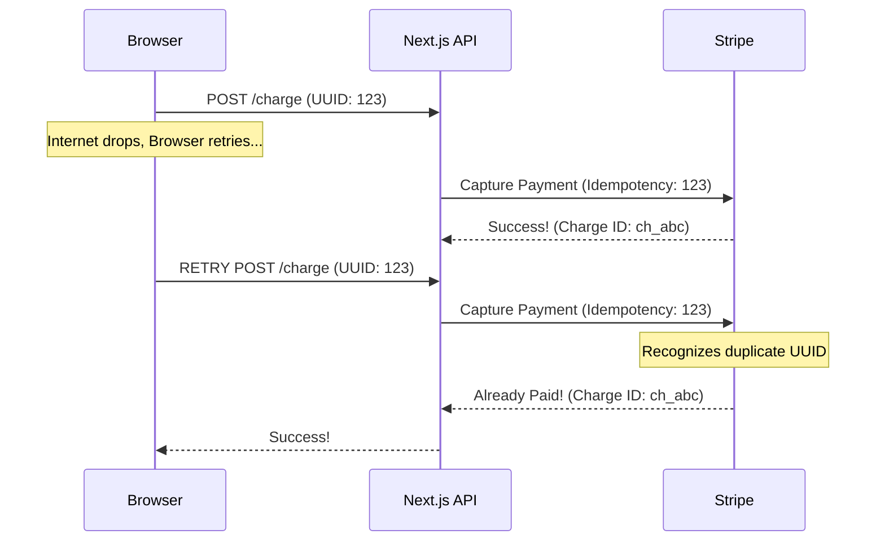

# Production Payment Engineering

**Estimated Time:** 60 Minutes

In Phase 2, you architected the theoretical security model of payments (Tokenization and Webhooks). Now, we write the code. 

If you write a sloppy payment integration, two things happen: 
1. **Double Charges:** A user's internet stutters, they click "Pay" twice, and they get charged $200 instead of $100.
2. **Ghost Orders:** The user gets charged $100, but the database crashes before the order is saved. The user loses their money, but your system has no record of the sale.

In this module, we will engineer a mathematically bulletproof Stripe integration using **Idempotency Keys** and the **Two-Phase Commit** pattern.

---

## 1. The Idempotency Key (Double-Charge Prevention)

When a mobile user is on a train and clicks "Pay", their 4G connection might drop exactly as the request is sent to your Next.js server. The browser doesn't receive a response, so it assumes the request failed. The user clicks "Pay" again.

If your Next.js server blindly forwards both requests to Stripe, Stripe will charge the user twice.

**The Production Solution:**
You must generate a unique UUID (Idempotency Key) on the client side the moment the checkout page loads. When the user clicks "Pay", you send that exact same UUID to Stripe in the HTTP Headers.



Stripe caches Idempotency Keys for 24 hours. If it sees the same key twice, it completely ignores the second request and just returns the receipt from the first request. The user is mathematically protected from double-charges.

### The Next.js API Implementation

```typescript
// app/api/checkout/route.ts
import { NextResponse } from 'next/server';
import Stripe from 'stripe';
import { v4 as uuidv4 } from 'uuid';

const stripe = new Stripe(process.env.STRIPE_SECRET_KEY!, { apiVersion: '2023-10-16' });

export async function POST(req: Request) {
  const { paymentMethodId, amount, idempotencyKey } = await req.json();

  try {
    const paymentIntent = await stripe.paymentIntents.create(
      {
        amount: amount,
        currency: 'usd',
        payment_method: paymentMethodId,
        confirm: true,
        automatic_payment_methods: {
          enabled: true,
          allow_redirects: 'never',
        },
      },
      {
        // THIS HEADER PREVENTS DOUBLE CHARGES
        idempotencyKey: idempotencyKey, 
      }
    );

    return NextResponse.json({ success: true, intent: paymentIntent });
  } catch (error) {
    // Graceful error handling for declined cards
    return NextResponse.json({ error: error.message }, { status: 400 });
  }
}
```

---

## 2. The Two-Phase Commit (Preventing Ghost Orders)

What happens if Stripe successfully charges the card, but your PostgreSQL database crashes exactly one millisecond later before it can save the `Order` row? You just stole $100 from a customer and you have no idea who they are. This is a "Ghost Order."

**The Production Solution:**
You must separate the intent to pay from the actual capture.

1. **Phase 1 (The Intent):** Before the user even clicks pay, you create a `PaymentIntent` in Stripe, and save an `Order` in your database with the status `PENDING`.
2. **Phase 2 (The Capture):** The user clicks Pay. Stripe captures the funds. Stripe fires an asynchronous Webhook to your server. Your server updates the `Order` status to `PAID`.

If your database crashes during Phase 2, it doesn't matter. The webhook will automatically retry for 3 days until your database comes back online.

### The Webhook Source of Truth

```typescript
// app/api/webhooks/stripe/route.ts
import { headers } from 'next/headers';
import { NextResponse } from 'next/server';
import { prisma } from '@/lib/prisma';
import stripe from '@/lib/stripe';

export async function POST(req: Request) {
  const body = await req.text();
  const signature = headers().get('stripe-signature') as string;

  let event;
  try {
    // 1. Cryptographically verify the webhook
    event = stripe.webhooks.constructEvent(body, signature, process.env.STRIPE_WEBHOOK_SECRET!);
  } catch (error) {
    return NextResponse.json({ error: 'Webhook signature verification failed' }, { status: 400 });
  }

  // 2. The Source of Truth Handler
  if (event.type === 'payment_intent.succeeded') {
    const paymentIntent = event.data.object;
    
    // Update the database safely
    await prisma.order.update({
      where: { stripeIntentId: paymentIntent.id },
      data: { status: 'PAID' }
    });

    // 3. Trigger Fulfillment via Event Bus
    // await inngest.send({ name: 'order.fulfillment', data: { orderId: paymentIntent.id } });
  }

  return NextResponse.json({ received: true });
}
```

---

## ✅ Payments Engineering Checklist

- [ ] Ensure the frontend generates a UUID (`uuidv4()`) on mount to use as the Idempotency Key.
- [ ] Pass the `idempotencyKey` in the exact headers of your Stripe SDK server request.
- [ ] Never rely on frontend success signals to mark an order as Paid.
- [ ] Implement the Webhook Source of Truth, rigorously verifying the HMAC signature before touching the database.
- [ ] Use the AI prompt below to generate the complete Stripe Elements integration.

---

## AI Prompt — Engineer the Stripe Integration

Copy this prompt into your AI to have it generate the exact Stripe frontend and backend code.

````prompt
I am building a headless e-commerce store with Next.js (App Router). I need you to act as my Principal Payment Engineer. We are writing the integration code for Stripe Elements.

I need you to generate the following strict, PCI-compliant code implementations:

**1. The Frontend Elements Component (`CheckoutForm.tsx`):**
Write the React Client Component using `@stripe/react-stripe-js`. 
- Generate a UUID `idempotencyKey` on component mount using `useMemo`.
- Render the `PaymentElement` to capture the card securely via iFrame.
- Write the `handleSubmit` function. It must prevent default submission, call `stripe.confirmPayment`, and handle 3D Secure (3DS) authentication challenges gracefully without crashing the UI.

**2. The Idempotent Server Action:**
Write the Next.js API route (`/api/create-payment-intent`) that the frontend calls before rendering the Elements. 
- Show how it calculates the final total mathematically on the server (do NOT trust the total sent by the client).
- Show how it creates a `PaymentIntent` and returns the `clientSecret` to the frontend.

**3. The Webhook Processor:**
Write the `/api/webhooks/stripe` Route Handler. 
- You MUST use `req.text()` to capture the raw body.
- Implement `stripe.webhooks.constructEvent` to verify the HMAC signature using `process.env.STRIPE_WEBHOOK_SECRET`.
- Write the `switch` statement that listens for `payment_intent.succeeded` and `payment_intent.payment_failed`, showing exactly how we update our database (e.g., Prisma) in response to these events.
````

**Next: Emails & Communications →**
