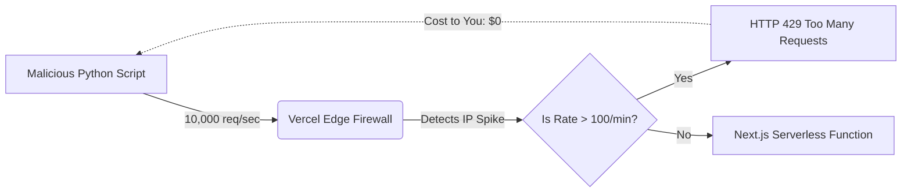

# DDoS Defense & Rate Limiting

**Estimated Time:** 60 Minutes

A beginner launches their store, goes to sleep, and wakes up to a $5,000 bill from Vercel and a crashed database.

Why? A competitor wrote a Python script that hits your `/api/search` endpoint 10,000 times a second. Your Next.js serverless functions auto-scaled infinitely to handle the traffic. Each function opened a database connection. The database crashed. Vercel charged you for 10 million function executions. This is a Layer 7 DDoS (Distributed Denial of Service) attack.

In Phase 4, you must engineer strict **Edge Rate Limiting**, configure **Cloudflare Bot Management**, and implement **Upstash Redis Throttling** on expensive API routes.

---

## 1. The Vercel Edge Firewall (WAF)

The cheapest and most effective way to block a DDoS attack is to block it before it even reaches your Next.js application.

**The Production Solution:**
You must configure the Vercel Web Application Firewall (WAF) or Cloudflare.



By configuring IP-based rate limiting at the Edge, Vercel instantly drops the malicious requests. Because the requests never trigger a Serverless Function execution, you are not charged for the compute time, and your database remains perfectly safe.

## 2. Granular API Throttling (Redis)

WAF rate limiting is based on IP addresses. But what if a hacker uses a botnet of 1,000 different IP addresses? The WAF might let them through.

Furthermore, some API routes are more expensive than others. You might allow 100 requests per minute to your Homepage, but you should only allow 5 requests per minute to your `/api/checkout` route.

**The Production Solution:**
You must implement granular, route-specific rate limiting using **Upstash Redis** and the `@upstash/ratelimit` algorithm (specifically the **Sliding Window** algorithm).

```typescript
// app/api/checkout/route.ts
import { Ratelimit } from "@upstash/ratelimit";
import { redis } from "@/lib/redis";
import { NextResponse } from "next/server";

// 1. Create a strict rate limiter: 5 requests per 10 seconds.
const ratelimit = new Ratelimit({
  redis: redis,
  limiter: Ratelimit.slidingWindow(5, "10 s"),
});

export async function POST(req: Request) {
  // 2. Extract the user's IP Address from the Vercel edge headers
  const ip = req.headers.get("x-forwarded-for") ?? "127.0.0.1";

  // 3. Check the limit
  const { success, pending, limit, reset, remaining } = await ratelimit.limit(ip);

  // 4. Mathematically block the request if the limit is exceeded
  if (!success) {
    return NextResponse.json(
      { error: "Too many requests. Please try again later." },
      { 
        status: 429, 
        headers: {
          'X-RateLimit-Limit': limit.toString(),
          'X-RateLimit-Remaining': remaining.toString(),
        } 
      }
    );
  }

  // 5. Proceed with the expensive checkout logic
  return NextResponse.json({ success: true });
}
```

The Sliding Window algorithm is mathematically superior to a Fixed Window algorithm. It prevents hackers from waiting until the 59th second of a minute to send 100 requests, and then sending another 100 requests at the 1st second of the next minute (a 200 request spike).

## 3. Bot Management (Turnstile / reCAPTCHA)

A hacker might write a script to test thousands of stolen credit cards on your checkout page (Card Testing Fraud). Because they use rotating proxies, IP-based rate limiting won't stop them.

**The Production Solution:**
You must implement a CAPTCHA. However, traditional CAPTCHAs (like clicking pictures of traffic lights) destroy conversion rates.

You must mandate the use of **Cloudflare Turnstile**. It is an invisible, mathematical challenge that verifies the browser is a real human without requiring any interaction. You inject the Turnstile token into your Next.js API request, and the server validates it before touching the Stripe API.

---

## ✅ Rate Limiting Engineering Checklist

- [ ] Configure the Vercel (or Cloudflare) Edge WAF to drop massive IP spikes before they incur serverless compute costs.
- [ ] Implement Upstash Redis Sliding Window rate limiting on expensive mutation routes (Checkout, Search, Login).
- [ ] Return strict `429 Too Many Requests` HTTP status codes with appropriate `X-RateLimit` headers.
- [ ] Mandate Cloudflare Turnstile (Invisible CAPTCHA) on the checkout route to mathematically defeat Card Testing botnets.

---

## AI Prompt — Engineer DDoS Defenses

Copy this prompt into your AI to have it generate the impenetrable rate-limiting architecture.

````prompt
I am building a headless e-commerce store with Next.js (App Router). I need you to act as my Principal Security Engineer. We are engineering our Rate Limiting and Bot Defense infrastructure.

I need you to generate the following strict defensive implementations:

**1. The Redis Sliding Window Limiter:**
Write a robust Next.js API Route handler (`/api/auth/reset-password`). 
- It must implement `@upstash/ratelimit`.
- Configure a `slidingWindow` algorithm strictly limiting requests to 3 per 1 hour per IP address.
- Show exactly how to extract the `x-forwarded-for` header to accurately identify the IP.
- Return a 429 status code with the exact `reset` timestamp passed into the response headers.

**2. The Turnstile Validation Middleware:**
Write a Next.js Server Action (`submitCheckout.ts`). 
- Assume the frontend passed a `turnstileToken` string along with the payload.
- Write the exact `fetch` request required to ping the `https://challenges.cloudflare.com/turnstile/v0/siteverify` endpoint.
- Show the `if` block that throws a `403 Forbidden` error if the Cloudflare API returns `success: false`, preventing the bot from accessing our Stripe logic.

**3. The Edge WAF Configuration:**
Write a brief Markdown explanation on how to configure the `vercel.json` or Vercel Dashboard to apply a global IP rate limit of 100 requests per 10 seconds across the entire `/api/*` directory, explaining how dropping traffic at the CDN layer saves us money.
````

**Next: Caching Engineering →**
