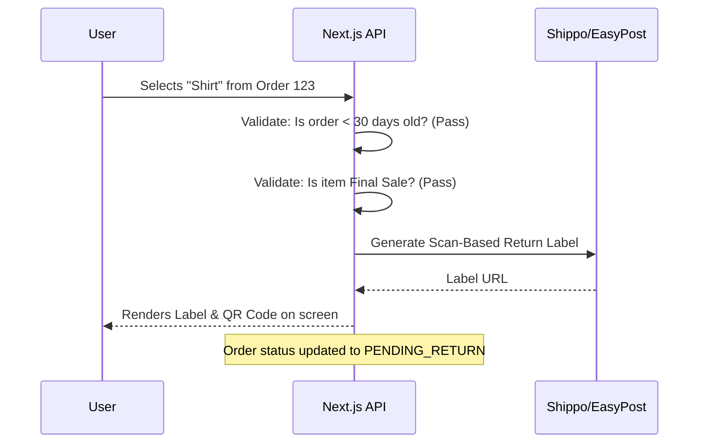

# Automated RMA Architecture (Return Merchandise Authorization)

**Estimated Time:** 60 Minutes

A beginner manages returns via email. A customer emails them: *"I want to return this."* The beginner manually logs into EasyPost, buys a $10 return label, emails the PDF back to the customer, and hopes the customer actually ships the item. 

If the customer is running a scam, they ship back an empty box filled with rocks. The beginner receives the box, realizes they were scammed, but they already refunded the money via Stripe. They lost the product, the money, and the $10 shipping label fee.

In a production environment, Returns are a massive logistical vulnerability. You must engineer an **Automated RMA Portal** and enforce **Scan-Based Return Labels**.

---

## 1. The RMA (Return Merchandise Authorization) Portal

You must eliminate email. Customers must log into a Next.js portal (`/account/returns`), select the specific items they want to return, and mathematically prove they are eligible.

**The Production Solution:**
You must build a Self-Service Return Portal backed by strict API logic.



If the customer tries to return an item marked as "Final Sale" (like underwear or clearance items), the Next.js API route throws a 403 error. The customer is physically blocked from generating the label.

## 2. Scan-Based Return Labels (Protecting Margins)

If you generate a standard shipping label via EasyPost, you are charged $10 instantly. If the customer changes their mind and never ships the return, you just lost $10 for no reason.

**The Production Solution:**
You must configure your Next.js API to request **Scan-Based Return Labels**. 

With a Scan-Based label, you generate the PDF and give it to the customer. You are charged **$0.00**. You are ONLY charged the $10 fee when the USPS postman physically scans the barcode at the post office. 

```typescript
// app/api/returns/generate-label/route.ts
const shipment = await easypost.Shipment.create({
  to_address: warehouseAddress,
  from_address: customerAddress,
  parcel: parcelDimensions,
  options: {
    // CRITICAL: Mathematically protects you from unused label costs
    print_custom_1: 'Return Label',
    invoice_number: orderId,
  },
  is_return: true // Generates a Pay-on-Scan label (carrier dependent)
});
```

## 3. The "Inspect Before Refund" Policy

Never automate the Stripe Refund. 

If your Inngest webhook automatically triggers the Stripe refund the moment the post office scans the return label, you are vulnerable to the "Box of Rocks" scam.

**The Production Solution:**
Your physical Return Policy document (and your backend architecture) must explicitly enforce an **"Inspect Before Refund"** pipeline.

1. Customer ships the box.
2. Warehouse receives the box.
3. A warehouse worker physically opens the box, verifies the shirt is inside, and clicks "Approve" in the Admin Dashboard.
4. ONLY THEN does the Next.js API execute the Stripe Refund (using the Idempotent architecture we engineered previously).

---

## ✅ Return Policy Engineering Checklist

- [ ] Build a Self-Service RMA portal in Next.js to eliminate manual customer support emails and enforce 30-day eligibility rules at the API level.
- [ ] Utilize 3PL APIs (Shippo/EasyPost) to generate Scan-Based Return labels, ensuring you are never charged for unused labels.
- [ ] Mathematically decouple the Return Label generation from the Stripe Refund execution to prevent "Box of Rocks" return fraud.
- [ ] Use the AI prompt below to generate the rigorous RMA architecture.

---

## AI Prompt — Engineer the RMA Portal

Copy this prompt into your AI to have it generate the mathematical return portal logic.

````prompt
I am building a headless e-commerce store with Next.js (App Router). I need you to act as my Principal Logistics Engineer. We are engineering our Self-Service RMA (Return Merchandise Authorization) Portal.

I need you to generate the following strict backend implementations:

**1. The RMA Validation Route:**
Write a Next.js API Route (`/api/returns/initiate`).
- It must read the `orderId` and an array of `lineItemIds` the user wants to return.
- Query Prisma to verify the order belongs to the user.
- Mathematically check if the order is > 30 days old. If so, throw a 403 Forbidden.
- Query the `Product` table to verify none of the items have `isFinalSale === true`. If they do, throw a 403 Forbidden.

**2. The EasyPost Scan-Based Label:**
Inside the same route, if all validations pass, show the `easypost.Shipment.create` logic required to generate a Pay-on-Scan return label.
- Update the Prisma `Order` status to `PENDING_RETURN`.
- Explain in Markdown why we absolutely MUST NOT execute the Stripe refund during this step, detailing the "Box of Rocks" fraud vector.
````

**Next: The Ultimate Launch Checklist →**
