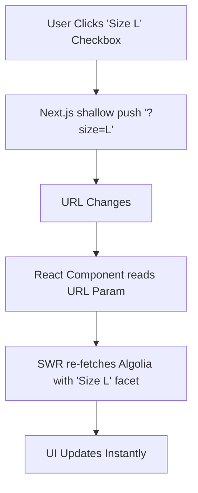

# High-Velocity Search Engineering

> [!TIP]
> **For Beginners:** If you are reading this and feeling overwhelmed by terms like "Redis", "PgBouncer", or "Idempotency", do not panic. 
> At the bottom of this document, there is an **AI Prompt**. You do not need to write this complex code yourself. You simply need to understand *why* this architecture is required, copy the AI Prompt, and paste it into Claude or ChatGPT to have it generate the production-ready code for you.


**Estimated Time:** 60 Minutes

In Phase 2, you architected the theory of decoupled search: you learned that SQL `LIKE` queries destroy databases, and you committed to a NoSQL index like Algolia or Typesense.

Now, in Phase 3, we write the code. Connecting a Next.js frontend to a massive search index requires deep optimization. If you fetch the entire product JSON from Algolia on every keystroke, you will force the user's mobile device to download megabytes of data, causing severe UI lag.

In this module, you will engineer a lightning-fast **Instant Search Modal**, implement strict API debouncing, and configure a headless Faceted Filtering system (Size, Color, Price) that recalculates in real-time.

---

## 1. The Instant Search UI & Debouncing

When a user types "S", "H", "O", "E", "S", the browser fires 5 separate keystroke events in half a second.

If your React component executes a `fetch` request to Algolia on every single keystroke, two things happen:
1. You burn through your API quota 5x faster than necessary.
2. The network responses arrive out of order. The response for "S" might arrive *after* the response for "SHO", causing the screen to flash wildly with incorrect results.

**The Production Solution:**
You must implement a **Debounce Hook**. A debounce forces the React component to wait (e.g., 300 milliseconds) after the user *stops* typing before it actually fires the network request.

```typescript
// hooks/useDebounce.ts
import { useState, useEffect } from 'react';

export function useDebounce<T>(value: T, delay: number): T {
  const [debouncedValue, setDebouncedValue] = useState<T>(value);

  useEffect(() => {
    // Set a timer to update the debounced value after the delay
    const timer = setTimeout(() => {
      setDebouncedValue(value);
    }, delay);

    // If the value changes BEFORE the delay is up, clear the timer and restart.
    // This prevents the fetch from firing until the user stops typing.
    return () => {
      clearTimeout(timer);
    };
  }, [value, delay]);

  return debouncedValue;
}
```

Your `<SearchInput />` component reads the raw keystrokes, but your SWR `fetch` request only listens to the `debouncedValue`. The user gets instant results, and your API quota is protected.

---

## 2. Faceted Filtering (The URL State Matrix)

A production category page requires complex filtering (e.g., filtering by "Color: Red" AND "Size: Large" AND "Price: Under $50").

If you let your AI store the active filters in a local React `useState` object, you have failed the architecture. If the user refreshes the page, the state is wiped out. If they copy the URL and send it to a friend, the friend sees the unfiltered page.

**The Production Solution:**
You must engineer **URL-Driven State**.
Every time a user clicks a filter checkbox, the React component must push that filter into the Next.js URL Search Parameters (`?color=red&size=L`). The Algolia query hook must read its parameters *directly from the URL*.



By making the URL the Source of Truth, the page is perfectly bookmarkable, shareable, and resilient to refreshes.

---

## 3. The Sync Pipeline (Flattening the Payload)

Algolia charges based on the size of the records you index. If you send the raw, massive GraphQL JSON response from Shopify directly to Algolia, you will ingest massive amounts of useless data (like internal Shopify IDs and rich-text HTML descriptions) that users never search for.

**The Production Solution:**
Your webhook sync route (`/api/sync-search`) must map and flatten the payload before sending it to Algolia.

```typescript
// The mapping logic inside your sync route
const rawShopifyProduct = await fetchShopifyProduct(webhookData.id);

// FLATTEN THE PAYLOAD
const algoliaRecord = {
  objectID: rawShopifyProduct.id,
  title: rawShopifyProduct.title,
  price: rawShopifyProduct.variants[0].price,
  image: rawShopifyProduct.images[0].url,
  // Send an array of sizes for faceted filtering
  sizes: rawShopifyProduct.variants.map(v => v.size), 
  // DO NOT send the massive HTML description. Algolia doesn't need it.
};

await index.saveObject(algoliaRecord);
```

By flattening the payload, you drastically reduce Algolia indexing costs and increase the search speed.

---

##  Search Engineering Checklist

- [ ] Implement a strict 300ms Debounce hook on the search input to protect your API quotas.
- [ ] Enforce URL-Driven State for all Faceted Filters (Size, Color, Price) so results are bookmarkable.
- [ ] Write a transformation function in your webhook route to flatten Shopify data before indexing it in Algolia.
- [ ] Use the AI prompt below to generate the exact Instant Search React code.

---

## AI Prompt — Engineer the Search Interface

Copy this prompt into your AI to have it write the highly optimized search components.

````prompt
I am building a headless e-commerce store with Next.js (App Router). I need you to act as my Principal Search Engineer. We are integrating our NoSQL Search Index (e.g., Algolia or Typesense).

We must optimize the client-side fetching to prevent UI lag and excessive API usage.

I need you to generate the following engineering implementations:

**1. The Debounced Search Hook:**
Write a highly typed `useDebounce` React hook. 
Then, write the `<GlobalSearchModal />` component. Show exactly how the user's raw keystrokes (`onChange`) are passed into the debounce hook with a 300ms delay. Show how the SWR (or Algolia InstantSearch hook) listens ONLY to the debounced string to trigger the network request.

**2. URL-Driven Faceted Filtering:**
Write the `<CategorySidebar />` React component. 
- It must render a list of Checkboxes for "Sizes". 
- When a user clicks a checkbox, use the Next.js `useRouter` or the `nuqs` library to perform a shallow push, appending `?size=L` to the URL without reloading the page.
- Show how the parent `<CategoryGrid />` component reads `useSearchParams()` and passes those exact URL parameters into the Algolia query to fetch the filtered results.

**3. The Payload Flattener:**
Write a TypeScript utility function (`formatForAlgolia(shopifyProduct)`) that takes a massive, nested Shopify Storefront GraphQL product object and returns a flat, optimized JSON object (`objectID`, `title`, `price`, `imageUrl`, `facets[]`). Explain why stripping out the HTML description saves us money on indexing costs.
````

**Next: Analytics Engineering →**
