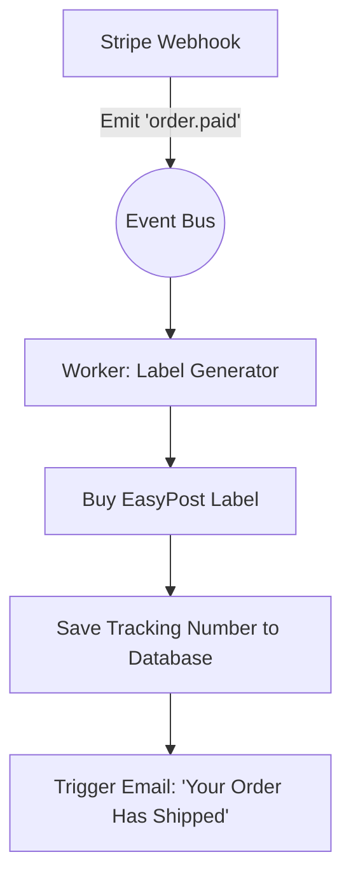

# Dynamic Shipping & Logistics API

**Estimated Time:** 60 Minutes

A beginner sets a "Flat Rate Shipping" fee of $10 in their database. When a customer from Hawaii orders a massive 50lb dumbbell, the beginner goes to the post office and discovers the actual shipping cost is $85. They just lost $75 on a single order.

In a production environment, shipping margins can destroy your business faster than advertising costs. You cannot rely on static numbers.

In Phase 3, you must engineer a **Dynamic Rating API** using **EasyPost** or **Shippo**. Your Next.js backend will calculate exact, volumetric shipping costs in real-time, injecting them into the checkout flow before the user pays.

---

## 1. The Volumetric Rating Engine

Shipping carriers (UPS, FedEx, USPS) do not care about the physical weight of your item. They care about **Dimensional Weight (DIM)**. A giant box of feathers takes up the same space on a truck as a giant box of bricks.

**The Production Solution:**
When the user enters their Zip Code in the checkout, your Next.js server must execute a background request to the EasyPost API. You must pass both the physical weight AND the precise LxWxH dimensions of the box.

```typescript
// app/api/shipping/rates/route.ts
import EasyPost from '@easypost/api';

const api = new EasyPost(process.env.EASYPOST_API_KEY);

export async function POST(req: Request) {
  const { toAddress, cartItems } = await req.json();

  // 1. Calculate the total volumetric footprint of the cart
  const totalWeight = cartItems.reduce((acc, item) => acc + item.weightOz, 0);
  
  try {
    // 2. Generate a real-time Shipment request
    const shipment = await api.Shipment.create({
      to_address: toAddress,
      from_address: {
        company: 'Your Store',
        street1: '123 Warehouse Ln',
        city: 'Austin',
        state: 'TX',
        zip: '78701',
      },
      parcel: {
        length: 12, // Calculated based on cart items
        width: 10,
        height: 8,
        weight: totalWeight,
      },
    });

    // 3. Return the exact carrier rates to the frontend
    return NextResponse.json({ rates: shipment.rates });
  } catch (err) {
    // Fallback logic if the API times out
  }
}
```

The frontend will display:
- USPS Priority Mail: $8.45
- UPS Ground: $12.10

You charge the customer exactly what the carrier will charge you. Zero margin loss.

## 2. Fallback Rate Caching (Resiliency)

What happens if it's Black Friday, and the USPS API goes down? The EasyPost API will throw a `500 Timeout` error. If you don't have a fallback, the shipping step in your checkout will crash, and the user cannot buy the product.

**The Production Solution:**
You must implement a **Fallback Matrix**. If the dynamic API fails, your code must instantly catch the error and return a static table of rates based on historical averages.

```typescript
    // ... inside the catch block of the API route above
  } catch (err) {
    console.error("EasyPost API Failed. Engaging Fallback Matrix.");
    
    // Fallback: A safe, slightly elevated average rate to protect margins
    const fallbackRates = [
      { id: 'fallback_std', service: 'Standard Shipping', rate: '10.00', currency: 'USD' },
      { id: 'fallback_exp', service: 'Expedited Shipping', rate: '25.00', currency: 'USD' }
    ];
    
    return NextResponse.json({ rates: fallbackRates });
  }
```

## 3. Asynchronous Label Generation

When the order is paid, you need to generate the actual PDF shipping label. 
**Do not do this synchronously in the Stripe Webhook.** Label generation takes 2-4 seconds. It will cause your webhook to time out.

**The Production Solution:**
You must delegate label generation to your Event Bus (Inngest).



This guarantees that even if the EasyPost API is down for an hour, the worker will simply pause and retry later, generating the label without manual human intervention.

---

## ✅ Shipping Engineering Checklist

- [ ] Execute real-time dynamic rating via EasyPost/Shippo, passing exact volumetric dimensions (LxWxH) to protect margins.
- [ ] Implement a strict Fallback Matrix (`catch` block) to ensure the checkout never crashes if the carrier API goes down.
- [ ] Delegate PDF Label Purchasing to an asynchronous Event Bus worker to protect your webhook response times.
- [ ] Use the AI prompt below to generate the Logistics API integration.

---

## AI Prompt — Engineer the Logistics Layer

Copy this prompt into your AI to have it generate the mathematical shipping architecture.

````prompt
I am building a headless e-commerce store with Next.js (App Router). I need you to act as my Principal Logistics Engineer. We are integrating the EasyPost (or Shippo) API for dynamic rating and label generation.

I need you to generate the following strict, fault-tolerant implementations:

**1. The Volumetric Rating Route:**
Write the Next.js API Route (`/api/shipping/rates`). 
- It must accept a destination address and an array of cart items.
- Write a mock algorithm that calculates the total required `length`, `width`, and `height` of a box needed to fit the cart items.
- Show the exact `EasyPost.Shipment.create` call.
- Write the `catch` block that implements a "Fallback Matrix" (returning a static $10 Standard rate) if the API times out.

**2. The Asynchronous Label Purchaser:**
Write the background Event Worker (e.g., using Inngest) that listens to the `order.ready_to_ship` event.
- Show how to use the EasyPost API to execute a `shipment.buy()` command.
- Extract the `tracking_code` and `postage_label.label_url` from the response.
- Show how to update our Prisma `Order` database with this tracking information, and emit a final `order.shipped` event to trigger the customer's email.
````

**Next: Wishlist Engineering →**
