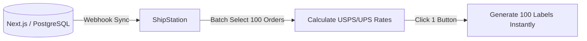

# Warehouse & Logistics Operations

> [!TIP]
> **For Beginners:** If you are reading this and feeling overwhelmed by terms like "Redis", "PgBouncer", or "Idempotency", do not panic. 
> At the bottom of this document, there is an **AI Prompt**. You do not need to write this complex code yourself. You simply need to understand *why* this architecture is required, copy the AI Prompt, and paste it into Claude or ChatGPT to have it generate the production-ready code for you.


**Estimated Time:** 45 Minutes

A beginner gets their first 50 orders, prints the PDF labels on a standard inkjet printer, cuts them out with scissors, and tapes them to the boxes. It takes them 4 hours to pack the orders.

When they scale to 500 orders a day, they physically cannot print and pack fast enough. The backlog grows, customers demand refunds, and the business collapses under its own operational weight.

In Phase 5, you must step away from the code and engineer physical **Warehouse Efficiency**, **Thermal Printing**, and **Fulfillment Integrations (3PL)**.

---

## 1. The Fulfillment Software Stack (ShipStation)

You cannot manage shipping by looking at your PostgreSQL database or your Stripe dashboard.

**The Production Solution:**
You must implement a Shipping Aggregator like **ShipStation** or **Shippo**. 

ShipStation acts as a physical operational layer. It connects to your database (or Shopify admin), pulls in all the orders, validates the addresses, and batches them.



ShipStation allows you to select 100 orders at once and click "Print". It calculates the cheapest carrier for every individual box automatically, saving you thousands of dollars a month in carrier fees.

## 2. Hardware: The Thermal Printer Architecture

Inkjet printers are a catastrophic bottleneck. They are slow, the ink smudges in the rain (destroying the barcode), and replacing the ink cartridges destroys your margins.

**The Production Solution:**
You must purchase a **Direct Thermal Printer** (e.g., Rollo, Zebra, or Dymo 4XL). 

Thermal printers use heat, not ink. You never have to buy ink cartridges again. They print a mathematically perfect, smudge-proof 4x6 label in 1 second. 

By upgrading to a thermal printer, your "Pick and Pack" time drops from 4 minutes per box to 30 seconds per box.

## 3. 3PL Integration (Third-Party Logistics)

If you are generating $1M/year in revenue, you should not be packing boxes in your garage. Your time is worth $150/hour; you are currently doing a $15/hour job.

**The Production Solution:**
You must transition to a **3PL (Third-Party Logistics)** provider (e.g., ShipBob, Deliverr).

You ship your entire inventory on wooden pallets directly from your manufacturer in China to a massive ShipBob warehouse in Texas.

**The Engineering Impact:**
When an order is placed on your Next.js site, you no longer ping EasyPost to buy a label. Instead, your Event Bus fires a webhook directly to the ShipBob API.

```typescript
// inngest/fulfillOrder.ts
export const fulfillOrder = inngest.createFunction(
  { id: "send-to-3pl" },
  { event: "order.paid" },
  async ({ event }) => {
    // 1. Send the order data to the ShipBob Warehouse API
    const response = await fetch('https://api.shipbob.com/1.0/order', {
      method: 'POST',
      body: JSON.stringify({
        reference_id: event.data.orderId,
        recipient: {
          name: event.data.customerName,
          address: event.data.shippingAddress,
        },
        products: event.data.lineItems.map(item => ({
          reference_id: item.sku,
          quantity: item.quantity
        }))
      })
    });
    
    // The robot in the Texas warehouse packs the box and ships it.
    // ShipBob will ping your webhook when the tracking number is generated.
  }
);
```

You run your massive e-commerce empire from a laptop on the beach. You never touch a cardboard box again.

---

## ✅ Shipping Operations Checklist

- [ ] Implement ShipStation (or similar) to centralize, batch, and optimize carrier rate purchasing.
- [ ] Eliminate inkjet bottlenecks. Mandate the use of a 4x6 Direct Thermal Printer (e.g., Rollo) for smudge-proof, zero-ink operations.
- [ ] At scale, engineer webhooks to transmit order payloads directly to a 3PL (ShipBob) to completely automate physical fulfillment.
- [ ] Use the AI prompt below to generate the 3PL integration architecture.

---

## AI Prompt — Engineer the 3PL Sync

Copy this prompt into your AI to have it generate the mathematical warehouse integration.

````prompt
I am building a headless e-commerce store with Next.js (App Router). I need you to act as my Principal Backend Engineer. We are engineering our automated 3PL (Third-Party Logistics) integration.

I need you to generate the following strict operational implementations:

**1. The 3PL Order Transmission Worker:**
Write an Inngest (or Upstash QStash) background worker that triggers when an order is paid. 
- Map our internal `Order` schema (containing SKUs and quantities) to a mock 3PL JSON payload.
- Execute the `fetch` request to transmit the order.
- Include a robust `catch` block that implements retry logic (e.g., `step.sleep('1h')`) if the 3PL API is temporarily down.

**2. The 3PL Tracking Webhook Receiver:**
Write the Next.js API Route (`/api/webhooks/3pl`) that the warehouse will ping when they have physically shipped the box.
- Extract the `tracking_number` and `carrier_name` from the payload.
- Show the Prisma query to update the `Order` status to `SHIPPED`.
- Show how this function then triggers an email API (Resend/SendGrid) to mathematically alert the customer that their package is on the way.
````

**Next: Tax Compliance Setup →**
