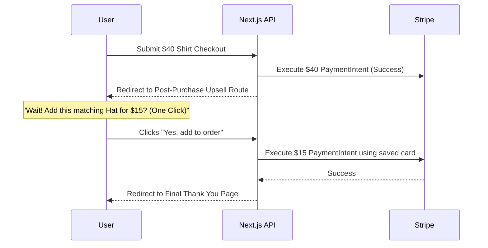

# Average Order Value (AOV) Maximization

> [!TIP]
> **For Beginners:** If you are reading this and feeling overwhelmed by terms like "Redis", "PgBouncer", or "Idempotency", do not panic. 
> At the bottom of this document, there is an **AI Prompt**. You do not need to write this complex code yourself. You simply need to understand *why* this architecture is required, copy the AI Prompt, and paste it into Claude or ChatGPT to have it generate the production-ready code for you.


**Estimated Time:** 60 Minutes

A beginner pays $30 in Facebook ads to acquire a customer. The customer buys a $40 shirt. The beginner makes $10 profit (before shipping and COGS), leaving them with effectively $0.

In a production environment, you do not accept the baseline transaction. You must engineer **Mathematical Upsells** to instantly maximize the Average Order Value (AOV) while the customer has their wallet open.

In Phase 6, you must engineer **One-Click Post-Purchase Upsells** and **Cart Threshold Bumping**.

---

## 1. Post-Purchase One-Click Upsells (OCU)

If you try to upsell a customer *before* they checkout, you introduce friction. They might get distracted, abandon the cart, and you lose the $40 sale entirely.

**The Production Solution:**
You must execute the upsell **after** the credit card has been charged, but **before** they reach the "Thank You" page. 

Because Stripe already validated the 3D Secure (3DS) challenge and captured the card details, you can legally charge the card a second time without requiring the user to re-enter their CVV.



This sequence mathematically guarantees you capture the baseline revenue first. The $15 upsell is pure margin.

```typescript
// app/api/upsell/accept/route.ts
export async function POST(req: Request) {
  const { originalOrderId, upsellProductId } = await req.json();

  const originalOrder = await prisma.order.findUnique({ where: { id: originalOrderId } });
  
  // 1. Retrieve the saved Payment Method from the original transaction
  const paymentMethods = await stripe.paymentMethods.list({
    customer: originalOrder.stripeCustomerId,
    type: 'card',
  });

  // 2. Execute a new PaymentIntent invisibly
  const upsellCharge = await stripe.paymentIntents.create({
    amount: 1500, // $15.00 Hat
    currency: 'usd',
    customer: originalOrder.stripeCustomerId,
    payment_method: paymentMethods.data[0].id,
    off_session: true, // Mathematically bypasses 3DS / OTP challenges
    confirm: true,     // Executes instantly
  });

  // 3. Append the item to the database Order so the warehouse packs it in the same box
  await appendItemToOrder(originalOrderId, upsellProductId);

  return NextResponse.json({ success: true });
}
```

## 2. Cart Threshold Bumping (Dynamic Shipping)

Humans are mathematically irrational. A customer will abandon a $40 shirt if shipping is $5. But they will gladly buy a $40 shirt AND a $20 hat if shipping is "Free over $50".

**The Production Solution:**
You must engineer a **Dynamic Cart Progress Bar** that calculates the exact delta required to unlock a psychological threshold, and recommends a specific product that perfectly fills that delta.

```tsx
// components/CartDrawer.tsx
export function CartDrawer({ cart }) {
  const FREE_SHIPPING_THRESHOLD = 50;
  const currentTotal = cart.reduce((acc, item) => acc + item.price, 0);
  const delta = FREE_SHIPPING_THRESHOLD - currentTotal;

  // 1. If they are $10 away, query the database for a product that costs exactly $10-$15
  const suggestedUpsell = useQuery(GET_PRODUCT_BY_PRICE_RANGE, { min: delta, max: delta + 5 });

  return (
    <div className="cart-drawer">
      {delta > 0 ? (
        <div className="bg-blue-50 p-4 rounded-md">
          <p className="font-bold">You are only ${delta} away from FREE Shipping!</p>
          <div className="w-full bg-gray-200 h-2 mt-2 rounded-full">
             <div className="bg-blue-500 h-2 rounded-full" style={{ width: `${(currentTotal / 50) * 100}%` }} />
          </div>
          
          {/* 2. Present the mathematical solution */}
          {suggestedUpsell && (
            <div className="mt-4 flex items-center gap-4">
              
              <div>
                <p>{suggestedUpsell.name}</p>
                <button onClick={() => addToCart(suggestedUpsell.id)}>
                  Add for ${suggestedUpsell.price}
                </button>
              </div>
            </div>
          )}
        </div>
      ) : (
        <div className="bg-green-50 p-4 font-bold text-green-700">
           You unlocked Free Shipping!
        </div>
      )}
      
      {/* Rest of Cart */}
    </div>
  );
}
```

By querying for an upsell that precisely fills the `$delta`, you remove cognitive load. The customer clicks "Add", you secure a $60 AOV, and the shipping cost is absorbed by the massive margin increase.

---

##  Upsells Engineering Checklist

- [ ] Ban pre-checkout popup interruptions. Engineer Post-Purchase One-Click Upsells (OCU) to secure the baseline revenue first.
- [ ] Utilize Stripe's `off_session: true` PaymentIntents to legally execute a secondary charge without forcing the customer to re-authenticate or re-enter their CVV.
- [ ] Build a mathematical Cart Progress Bar that calculates the delta to Free Shipping, and dynamically queries Prisma for a "Cart Bumper" product that perfectly fills the gap.
- [ ] Use the AI prompt below to generate the rigorous upsell logic.

---

## AI Prompt — Engineer Post-Purchase Upsells

Copy this prompt into your AI to have it generate the mathematical AOV maximization engine.

````prompt
I am building a headless e-commerce store with Next.js (App Router). I need you to act as my Principal Payment Engineer. We are engineering a One-Click Post-Purchase Upsell architecture.

I need you to generate the following strict backend implementations:

**1. The Stripe Off-Session Charge:**
Write the Next.js API Route (`/api/upsell/charge`).
- Assume the frontend passes the `stripeCustomerId` and the `upsellPriceId`.
- Show the exact `stripe.paymentIntents.create` call.
- You MUST explicitly include `off_session: true` and `confirm: true`. Explain in Markdown why `off_session: true` is legally required to bypass European SCA (Strong Customer Authentication) 3DS challenges on a post-purchase click.

**2. The Order Mutator:**
Write the Prisma logic to update the existing `Order` record.
- Show how to push the new upsell `lineItem` into the existing Order array, ensuring the 3PL Warehouse worker packs both items into the exact same physical cardboard box to preserve our shipping margins.
````

**Next: Cross-Sells & Bundling Engineering →**
