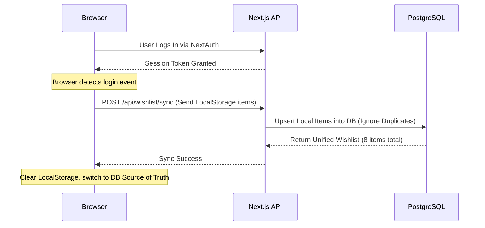

# Distributed Wishlist Architecture

> [!TIP]
> **For Beginners:** If you are reading this and feeling overwhelmed by terms like "Redis", "PgBouncer", or "Idempotency", do not panic. 
> At the bottom of this document, there is an **AI Prompt**. You do not need to write this complex code yourself. You simply need to understand *why* this architecture is required, copy the AI Prompt, and paste it into Claude or ChatGPT to have it generate the production-ready code for you.


**Estimated Time:** 45 Minutes

A beginner builds a wishlist by adding a "Heart" button that sends a `POST` request to the database. If a user isn't logged in, the button throws an error, forcing them to create an account. The user gets annoyed, closes the tab, and the intent-to-buy is lost forever.

In a production environment, the Wishlist is the most powerful tool for capturing high-intent leads. You must allow anonymous users to build massive wishlists frictionlessly.

In Phase 3, you must engineer an **Optimistic UI Heart Button**, build an **Anonymous LocalStore Cache**, and implement a **Post-Login Merge Conflict Resolver**.

---

## 1. Optimistic UI (The 0ms Heart Button)

When a user clicks the "Heart" button on a product, they expect instant visual feedback. If your React component waits 500ms for the Next.js server to confirm the database save before turning the heart red, the UI feels sluggish and broken.

**The Production Solution:**
You must implement **Optimistic UI** using SWR or React `useOptimistic`.

```tsx
'use client';
import useSWR from 'swr';
import { Heart } from 'lucide-react';

export function WishlistButton({ productId }: { productId: string }) {
  const { data: wishlist, mutate } = useSWR('/api/wishlist');
  const isHearted = wishlist?.includes(productId);

  const toggleWishlist = async () => {
    // 1. OPTIMISTIC UPDATE: Instantly turn the heart red/gray in the UI without waiting
    mutate(
      isHearted ? wishlist.filter(id => id !== productId) : [...(wishlist || []), productId],
      false // Do not revalidate yet
    );

    // 2. BACKGROUND FETCH: Actually save to the database
    await fetch('/api/wishlist/toggle', {
      method: 'POST',
      body: JSON.stringify({ productId })
    });

    // 3. REVALIDATE: Sync the UI with the final database truth
    mutate();
  };

  return (
    <button onClick={toggleWishlist}>
      <Heart className={isHearted ? 'fill-red-500' : 'fill-none'} />
    </button>
  );
}
```

The user sees the heart turn red in exactly **0 milliseconds**. The network request happens invisibly in the background.

## 2. The Anonymous Local Cache

You must allow users who are not logged in to use the wishlist.

**The Production Solution:**
Your `useWishlistStore` must use Zustand with `localStorage` persistence (exactly like the Cart). When an anonymous user clicks the Heart button, the `productId` is saved directly to their browser. 

If they leave the site and come back three days later, the heart on that product is still red. They have built an emotional attachment to the curation of their list.

## 3. The Post-Login Merge Resolver

When the anonymous user finally decides to log in (perhaps triggered by a "Save your wishlist" prompt), you now have two disparate states:
1. The 5 items they just added to their anonymous `localStorage`.
2. The 3 items they had saved in the PostgreSQL database from a previous session a month ago.

**The Production Solution:**
You must engineer a **Merge Strategy** in your NextAuth login callback or post-login redirect.



The backend API handles the deduplication (relying on the `@@unique([userId, productId])` constraint we built in the Database module) and returns a perfectly unified list. The user loses nothing.

---

## ✅ Wishlist Engineering Checklist

- [ ] Implement Optimistic UI using SWR mutations to guarantee a 0ms visual response when the Heart button is clicked.
- [ ] Build an anonymous `localStorage` cache (via Zustand) to capture intent before the user logs in.
- [ ] Engineer a Post-Login Merge API route that upserts the local cache into PostgreSQL upon authentication.
- [ ] Use the AI prompt below to generate the complete architecture.

---

## AI Prompt — Engineer the Wishlist

Copy this prompt into your AI to have it generate the complex optimistic state management code.

````prompt
I am building a headless e-commerce store with Next.js (App Router). I need you to act as my Principal Frontend Engineer. We are engineering our Wishlist architecture.

I need you to generate the following strict React and API implementations:

**1. The Optimistic Heart Component:**
Write the `<WishlistButton productId={id} />` Client Component. 
- You MUST use `useSWR` to fetch the user's active wishlist array.
- Write the `toggleWishlist` function showing exactly how to use the SWR `mutate(optimisticData, false)` function to instantly turn the Heart icon red without waiting for the network response.

**2. The Zustand Local Cache:**
Write the `store/useWishlistStore.ts` file using Zustand and the `persist` middleware. 
- It should store an array of `productIds`. 
- This will act as the fallback for anonymous users.

**3. The Post-Login Merge API:**
Write the Next.js API Route (`/api/wishlist/sync`). 
- It must accept an array of `productIds` from the frontend's local storage.
- Show how to use a Prisma transaction with a `createMany` query and `skipDuplicates: true` to merge these new items into the user's existing PostgreSQL wishlist without crashing on unique constraint violations.
````

**Next: Admin Dashboard Engineering →**
