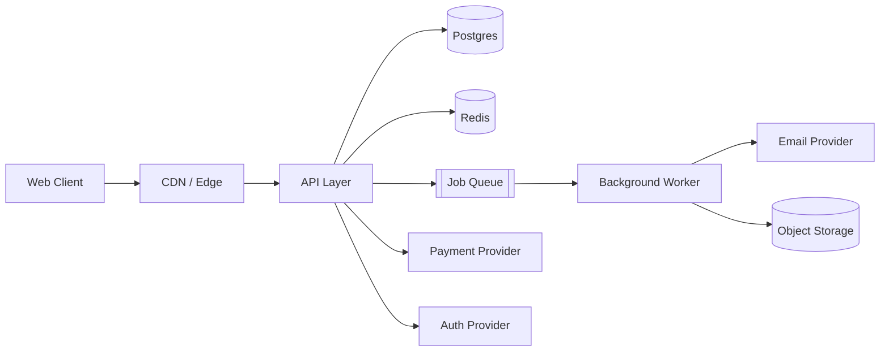

# System Architecture Diagram

A system architecture diagram is the single artifact that lets you (and anyone else, including future AI sessions) see how every piece of your product connects — before you write a line of code that assumes a connection that doesn't exist. Skipping this step means architecture decisions get made implicitly, one file at a time, by whoever happens to be writing that feature. That's how production systems end up with three different ways of talking to the same database.

This is a high-level diagram. You're mapping boxes and connections, not class structures — that level of detail comes later in Backend Architecture and API Design.

---

## Decision 1: What Belongs in This Diagram

> **Decision Card — Standard Production SaaS Components**
> Map these, using your actual Tech Stack Selection decisions — not generic placeholders:
- **Client** (web app, and mobile if applicable)
- **CDN/Edge** (static assets, possibly edge functions)
- **Application server/API layer** (your monolith or backend service)
- **Database** (primary data store)
- **Cache** (Redis or similar, if you're using one)
- **Background job/queue system** (for async work — emails, exports, webhooks)
- **Third-party integrations** (payments, transactional email, auth provider, file storage)
- **Object storage** (user uploads, generated files)

If a box in your diagram doesn't correspond to a real decision you've already made, that's a sign you're inventing architecture instead of documenting it.

---

## Decision 2: Sync vs. Async Boundaries

This is the most important thing this diagram should make visible — and the thing most beginner diagrams miss entirely.

> [!WARNING]
> Anything slow (sending email, processing a file, calling a third-party API that might be down) should not happen inline in a request a user is waiting on. Draw a clear line in your diagram between the **synchronous request path** (what the user waits for) and the **asynchronous path** (queued jobs, webhooks, scheduled tasks). If your diagram doesn't have a queue/background job box, you'll likely end up blocking user-facing requests on slow third-party calls.

---

## Decision 3: Where Trust Boundaries Live

Mark explicitly on the diagram:

- [ ] Where authentication happens (which box verifies who the user is)
- [ ] Where the multi-tenant boundary is enforced (which layer checks "does this user belong to this workspace")
- [ ] Which boxes are publicly reachable vs. internal-only

>  **Best Practice**
> Authentication and tenant-scoping should happen in exactly one place in your request path (typically middleware in your API layer), not re-implemented per route. Your diagram should make it obvious there's one gate, not many.

---

## Decision 4: Identify Single Points of Failure

For each external dependency on your diagram (payment provider, email service, auth provider), ask: **what happens to the user if this is down?** You don't need to solve every failure mode now, but you should know which ones exist before you build, not discover them during an incident.

| Dependency type | Common failure mode to plan for |
|---|---|
| Payment provider | Checkout fails — show a clear error, don't silently fail |
| Email service | Transactional emails delayed/dropped — don't block account creation on email success |
| Auth provider (if third-party) | Login unavailable — understand your fallback, if any |

---

## Example Diagram (Mermaid)

This is the level of detail appropriate for this phase — adjust boxes to match your actual stack:



---

## Common AI Mistakes to Watch For

- **Invents services not in your tech stack** — e.g., adds a message broker or extra microservice you never decided on. Cross-check every box against Tech Stack Selection.
- **Over-details too early** — produces a diagram with internal class structure or database columns. That's not this phase's job.
- **Omits the async path entirely** — draws only the synchronous request flow, missing queues/background jobs.
- **Doesn't mark trust boundaries** — diagram shows connections but not where auth/tenant checks happen.
- **Draws a diagram of microservices for a monolith decision** — always reflect your actual architecture decision, not a generic "best practice" template.

---

## AI Prompt: Generate Your System Architecture Diagram

```prompt
Generate a system architecture diagram in Mermaid syntax for a production SaaS, based strictly on these decisions — do not introduce components I haven't listed.

Stack decisions:
- Frontend: [from Tech Stack Selection]
- Backend pattern: [monolith / separate backend / serverless]
- Database: [your choice]
- Cache: [yes/no, which]
- Background jobs: [yes/no, which system]
- Third-party services: [payments, email, auth provider, storage — list what you're actually using]

Requirements:
- Clearly separate the synchronous request path from the asynchronous (queue/background job) path
- Mark where authentication and multi-tenant checks occur
- Do not add any service, database, or integration not listed above
- Flag any single point of failure among the third-party services and note what should happen to the user if it goes down
```

---

## Validate Before You Move On

- [ ] Every box in the diagram corresponds to a real decision from Tech Stack Selection
- [ ] Synchronous and asynchronous paths are visually distinct
- [ ] Authentication and multi-tenant boundaries are explicitly marked
- [ ] Every third-party dependency's failure mode has at least a one-line answer
- [ ] No microservice complexity appears unless you deliberately chose that pattern
- [ ] You could explain this diagram to another engineer in under two minutes

> [!TIP]
> Keep this diagram as a living reference, not a one-time artifact. Paste it into prompts for Backend Architecture, Database Schema, and API Design instead of re-describing your system from scratch each time.

---

**Next:** Frontend Architecture — define how the client-side box on this diagram is actually structured.
